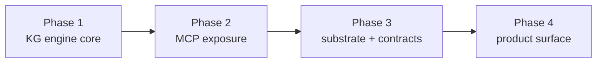

# oxibrain — Unified Memory & Knowledge Platform

> **Version:** v0.1 (design draft) · **Date:** 2026-08-11
> **Status:** Design — not yet implemented. Canonical for this project; superseded only by a newer dated revision.
> **Authority:** This document is the design source of truth for oxibrain. When it disagrees with a consumer project's notes, this document wins until a newer revision exists.

---

## 0. TL;DR

**oxibrain** is the single memory & knowledge substrate for the oxi ecosystem. It gives every oxi agent — and any external MCP client — structured, temporally-aware, relationship-centric long-term memory and knowledge. It realizes the *Knowledge Graph × MCP × Agent* architecture natively in Rust, built on the existing `oxios-memory` substrate, and packaged as a standalone platform that `oxios`, `oximemo`, `oxiline`, and external tools all consume.

Three motivations converge on one platform:

| Axis | What it buys |
|------|--------------|
| **Intelligence** | Agents reason over an entity–relation–temporal graph, not flat text (Think-on-Graph, multi-hop). |
| **Architecture** | Memory / knowledge / MCP promoted out of the oxios monolith into a reusable substrate with a clean consumption contract. |
| **Product** | A standalone "second brain" usable by any MCP client, with oxios as *one consumer among many*. |

---

## 1. Context & motivation

The oxi ecosystem is Rust-first: `oxios` (Agent OS), `oximemo` / `oxiline` (Tauri desktop), `oxibuilder` (web platform), `oxicode` (agent SDK), `oxibrowser`, plus marketing sites. Today the only cross-project shared artifacts are `oxicode-sdk` (Rust) and the visual `DESIGN.md`. The *engineering* and *memory* layers are fragmented: every agent re-derives how it remembers.

Inside `oxios`, the memory/knowledge surface is already split into three **leaf crates** (zero oxios dependencies — verified in `oxios/publish.yml`):

- **`oxios-memory`** — tiered agent memory extracted per RFC-018. Substantial: embeddings (TF-IDF + GGUF + HNSW + sqlite-vec), SQLite backend, decay, compaction, `dream` consolidation, `SONA` pattern engine, proactive recall, lexical/semantic/RRF search.
- **`oxios-markdown`** — file-based knowledge base (`KnowledgeBase`): markdown files, tree, backlinks, journal, habits, checklist, git history. Exposed via `knowledge_routes.rs`. The existing `/api/knowledge/graph` is a **backlink graph** (file→file links), not a semantic KG.
- **`oxios-mcp`** — MCP bridge (client/protocol/validation). Agents call external tools/resources.

**The gap.** The graph concept that exists is a *co-access PageRank* graph (`memory/graph.rs`) for importance scoring — nodes are memory IDs, edges are "accessed in same session." It is **not** an entity–relation–attribute knowledge graph. What the KG×MCP×Agent vision requires and oxios lacks:

1. An **entity–relation–attribute** model with **temporal edge validity** (Graphiti's contribution: every edge carries `valid_from`/`valid_to`).
2. An **LLM extraction pipeline** turning episodes (notes, conversations, documents) into entities/relations with **provenance** (no hallucinated facts — every fact traces to a source).
3. **MCP exposure** of the graph so any client can read/write/query.
4. A **single deployment unit** reusable across `oxios`, `oximemo`, `oxiline`, and external clients.

The infrastructure is ~70% built; the gap is the semantic temporal KG layer, extraction, and packaging.

---

## 2. Goals & non-goals

### Goals (v1)

- First-class **entity–relation–attribute temporal KG** as agent memory, alongside the existing tiered/episodic memory.
- **LLM extraction pipeline**: episodes → entities/relations/observations, grounded in provenance.
- **Hybrid query**: lexical (BM25) + semantic (vector/HNSW) + graph traversal (Think-on-Graph), fused via RRF.
- **MCP server surface** so any client (`oxios`, Claude, …) reads/writes the graph.
- **Single in-process Rust engine**, statically linkable into the `oxios` binary and Tauri apps — no external database process, no Python runtime.
- **oxios becomes a consumer** of the platform; the substrate is reusable ecosystem-wide.

### Non-goals (v1)

- A graph-database dependency (Neo4j / FalkorDB). Embedded only.
- A Python runtime anywhere in the hot path.
- A cloud/hosted service. Local-first, consistent with `oximemo`/`oxiline`.
- Replacing `oxios-markdown`'s file KB. It becomes a **source** that feeds the graph, not a victim of it.
- A polished standalone UI. That is Phase 4; v1 exposes Rust + MCP surfaces only.

---

## 3. Relationship to the oxi ecosystem

oxibrain **promotes** the three leaf crates out of the `oxios` workspace into its own workspace, and **adds** the KG + MCP layer on top. `oxios` becomes a consumer (depends on the oxibrain crates). Other apps consume via in-process Rust API (Tauri/desktop) or via MCP (external, headless).

```
            ┌──────────────────────────────────────────────────┐
CONSUMERS   │ oxios  ·  oximemo  ·  oxiline  ·  external Claude │
            │   (Rust API, in-proc)        (MCP, any client)    │
            └───────────────────────┬──────────────────────────┘
                                    │
            ┌───────────────────────▼──────────────────────────┐
oxibrain    │ oxibrain-mcp  ── MCP server surface               │
            ├──────────────────────────────────────────────────┤
            │ oxibrain-core ── KG + memory engine               │
            │   • entity–relation–attribute temporal graph      │
            │   • LLM extraction (episodes → entities/edges)    │
            │   • hybrid query (BM25 + vector + ToG), RRF       │
            ├──────────────────────────────────────────────────┤
SUBSTRATE   │ memory substrate (promoted from oxios-memory)     │
(promoted)  │ embeddings · SQLite+sqlite-vec · decay · dream    │
            │ proactive · SONA · search(vector/bm25/rrf)        │
            │ + oxios-markdown KB as a knowledge *source*       │
            └──────────────────────────────────────────────────┘
```

**Migration policy (clean cutover with a window):** the published crates (`oxios-memory`, `oxios-mcp`, …) keep their names on crates.io during migration. Inside the oxibrain workspace they become `oxibrain-memory`, `oxibrain-markdown`, `oxibrain-transport`. The old names ship as thin re-export shims until `oxios` fully migrates, then the shims are retired. This satisfies the oxi "migrate every caller; leave no shims" principle on a realistic schedule for already-published crates.

---

## 4. Architecture

### 4.1 Layering

```
┌─────────────────────────────────────────────────────────────┐
│ oxibrain-mcp   MCP server: tools + resources (§8)            │
├─────────────────────────────────────────────────────────────┤
│ oxibrain-core                                                 │
│  ┌───────────────────┐  ┌────────────────────────────────┐  │
│  │ Extraction pipeline│  │ Query engine                    │  │
│  │ episode→entities   │  │ lexical + semantic + ToG → RRF  │  │
│  │ →resolve→upsert    │  │ temporal / neighborhood / multi │  │
│  └─────────┬─────────┘  └──────────────┬─────────────────┘  │
│            │                            │                     │
│  ┌─────────▼────────────────────────────▼─────────────────┐  │
│  │ KG store: entity / relation / observation / fact        │  │
│  │   (temporal-validity edges, provenance links)          │  │
│  └─────────┬─────────────────────────────────────────────┘  │
│            │ embed + persist                                   │
│  ┌─────────▼─────────────────────────────────────────────┐  │
│  │ Memory substrate (oxibrain-memory)                     │  │
│  │   embeddings · SQLite + sqlite-vec · HNSW · BM25 · RRF │  │
│  │   decay · compaction · dream · proactive · SONA        │  │
│  └───────────────────────────────────────────────────────┘  │
└─────────────────────────────────────────────────────────────┘
```

### 4.2 Key invariants

- **Provenance is mandatory.** Every entity, relation, and observation references the episode that produced it. A fact with no provenance is a bug, not a feature.
- **Time is bi-temporal.** A relation carries both *valid time* (when it was true in the world) and *transaction time* (when the system recorded it). Edges are versioned, never overwritten — a new validity window supersedes the old; the old is retained for `timeline` queries.
- **Single source of embeddings.** The substrate owns embedding; the KG layer never re-implements vector math.
- **In-process first.** The engine is a library. The MCP server is one *adapter* over it, not the core.

---

## 5. Data model

Borrowed deliberately: the **temporal entity–relation** model from Graphiti, and the **entity / relation / observation** vocabulary from the `mcp-knowledge-graph` memory server. These are design references, not runtime dependencies.

### 5.1 Core entities

```rust
/// A typed node in the knowledge graph.
struct Entity {
    id: EntityId,            // content-hash of (type, canonical name)
    ty: EntityType,          // Person | Project | Concept | Place | Event | Code | …
    name: String,            // canonical name
    aliases: Vec<String>,    // alternate spellings / names (for resolution)
    attributes: Map<String, Value>,
    created_at: DateTime,
    // embeddings computed & stored by the substrate, not here
}

/// A typed, directed, temporally-valid edge between two entities.
struct Relation {
    id: RelationId,
    subject: EntityId,
    object: EntityId,
    kind: RelationKind,      // works_on | part_of | depends_on | knows | located_in | …
    // — bi-temporal validity (Graphiti) —
    valid_from: Option<DateTime>,
    valid_to:   Option<DateTime>,   // None = still true
    recorded_at: DateTime,
    provenance: EpisodeId,          // episode that asserted this
    attributes: Map<String, Value>,
}

/// A discrete piece of information attached to an entity (mcp-kg "observation").
struct Observation {
    id: ObservationId,
    entity: EntityId,
    content: String,         // e.g. "prefers dark mode", "birthday 1990-03-01"
    valid_from: Option<DateTime>,
    valid_to:   Option<DateTime>,
    recorded_at: DateTime,
    provenance: EpisodeId,
}

/// The raw source — a memory entry, conversation turn, note, document chunk.
/// Entities/relations/observations are *extracted from* episodes and link back.
struct Episode {
    id: EpisodeId,
    source: Source,          // Conversation | Note(path) | Document | MemoryEntry
    content: String,
    occurred_at: DateTime,
    ingested_at: DateTime,
}

/// A denormalized, queryable view: (subject, kind, object, value) + validity + provenance.
struct Fact {
    subject: EntityId,
    kind: RelationKind,
    object: Option<EntityId>,
    value: Option<Value>,
    valid_window: TemporalWindow,
    provenance: EpisodeId,
}
```

### 5.2 Storage

The KG lives in the same SQLite database as the substrate's tiered memory, in four new tables (`entities`, `relations`, `observations`, `facts`) plus a join for provenance. `sqlite-vec` backs entity-name and fact semantic indexes; HNSW stays the in-memory accelerator (already implemented). No new database engine is introduced.

---

## 6. Extraction pipeline

```
Episode (text)
   │  1. chunk (reuse substrate chunking)
   ▼
Chunks
   │  2. LLM extraction (oxicode-sdk engine): prompt → entities[] / relations[] / observations[]
   ▼
Candidates
   │  3. entity resolution: match against aliases + embedding similarity; merge or create
   ▼
Resolved
   │  4. temporal upsert: open/close validity windows; never overwrite a relation
   ▼
Graph (+ provenance back to the Episode)
```

- **Step 2** uses the `oxicode-sdk` agent loop (the engine oxios already uses) with a schema-constrained extraction prompt. The schema is the data model in §5.
- **Step 3** reuses substrate embeddings: a candidate entity resolves to an existing one if name-alias or embedding similarity exceeds threshold; otherwise a new entity is created with the candidate as its first alias.
- **Step 4** is the integrity core: if Alice "works_on ProjectX" already has an open window and a new episode reasserts it, the window is confirmed (recorded_at advanced); if a new episode asserts Alice "works_on ProjectY", the ProjectX window is *closed* (`valid_to = now`) and ProjectY opened — the history is retained.

The extraction pipeline is the real product value of oxibrain. It is where the bulk of Phase 1 implementation effort goes.

---

## 7. Query

Three retrieval modes, fused into one ranked result set:

| Mode | Reuses | Returns |
|------|--------|---------|
| Lexical | BM25 (substrate `search/bm25.rs`) | episodes/observations matching terms |
| Semantic | vector + HNSW (`search/vector.rs`) | entities/facts by meaning |
| **Graph traversal (ToG)** | **NEW** — multi-hop over entity–relation edges | entity neighborhoods, paths, temporally-valid facts |

A single `query` operation accepts a mode (or `hybrid`) and returns fused results via **RRF** (reciprocal rank fusion — already in `search/rrf.rs`). Think-on-Graph is implemented as a bounded-depth traversal that the agent drives through MCP (see `traverse` tool), so the LLM performs the reasoning step and the engine returns candidate subgraphs.

Temporal query (`timeline`): "what was true about Entity X on date Y?" → filter facts by `valid_window` containing Y.

---

## 8. MCP surface (`oxibrain-mcp`)

The MCP server is a thin adapter over `oxibrain-core`. Tools:

| Tool | Purpose |
|------|---------|
| `query` | Hybrid search (lexical / semantic / graph) over memories + facts. |
| `recall` | Contextual recall for an agent (wraps proactive recall + KG neighborhood). |
| `ingest` | Feed an episode (text/note/doc/conversation) → run extraction pipeline. |
| `add_entity` / `add_relation` / `add_observation` | Explicit, schema-validated writes (no LLM in the loop). |
| `get_entity` | Entity + its attributes + current relations. |
| `traverse` | Multi-hop graph traversal for Think-on-Graph reasoning (returns subgraph). |
| `timeline` | Temporal query: facts valid at a given time. |

Resources: the knowledge graph exposed as a browsable resource (entity/relation listings) for MCP clients that prefer resource semantics over tool calls.

This surface is what makes oxibrain consumable by **external** clients (Claude Desktop, other MCP hosts) — fulfilling the "product" axis — without coupling them to Rust.

---

## 9. Crate / workspace layout

```
oxibrain/
├── AGENTS.md                 # project conventions (this repo's canonical)
├── doc/
│   └── DESIGN.md             # this file
├── crates/
│   ├── oxibrain-core/        # KG + memory engine (extraction, query, store)
│   ├── oxibrain-mcp/         # MCP server adapter over core
│   ├── oxibrain-memory/      # promoted from oxios-memory (substrate)
│   ├── oxibrain-markdown/    # promoted from oxios-markdown (KB source)
│   └── oxibrain-transport/   # promoted from oxios-mcp (MCP client/protocol)
└── (Phase 4) apps/           # standalone second-brain UI, later
```

**Phase-1 bootstrap:** `oxibrain-core` is developed in this repo depending on the *published* `oxios-memory` crate (so work starts immediately, no big-bang migration). The substrate is physically promoted into the workspace in Phase 3.

---

## 10. Build-vs-buy rationale

Three options were considered:

| | A. Buy (Graphiti sidecar) | **B. Hybrid Rust-native (chosen)** | C. Build from scratch |
|---|---|---|---|
| Core | Wrap Graphiti MCP server (1.0, 20k★) | KG layer on `oxios-memory`, Graphiti model as design reference | Re-implement embeddings/SQLite too |
| Runtime | **Python service + Neo4j/FalkorDB** | **In-process Rust (static link)** | In-process Rust |
| Ecosystem fit | Poor — Python + graph-DB sidecar on a Rust-only, single-binary, Tauri-desktop ecosystem | Best — one Rust substrate, embeds in `oxios` binary + Tauri apps | Best fit, but wastes the 70% already built |
| External-client compat | Excellent (Graphiti MCP as-is) | Good (own MCP server, spec-compliant) | Good |

**Decision: B.** The unified-substrate goal *requires* an in-process engine — `oxios` is a single binary (`include_dir!`-embedded web), `oximemo`/`oxiline` are static Tauri. A Python + Neo4j sidecar would fracture the "one substrate" vision and impose an operational tax a solo developer should not carry. Graphiti's *temporal entity–relation model* and the `mcp-knowledge-graph` *entity/relation/observation* schema are adopted as **design references** (their data model and protocol shape), not as runtime dependencies. We own the implementation so it is a first-class part of the oxi platform.

---

## 11. Phased roadmap



- **Phase 1 — KG engine core.** Data model (§5) + SQLite tables; extraction pipeline (§6); hybrid query incl. graph traversal (§7). Deliverable: `oxibrain-core` library with tests, depending on published `oxios-memory`.
- **Phase 2 — MCP exposure.** `oxibrain-mcp` server (§8): the tool/resource surface. Deliverable: any MCP client (including external Claude) can read/write/query oxibrain.
- **Phase 3 — substrate promotion + consumption contracts.** Promote `oxios-memory`/`oxios-markdown`/`oxios-mcp` into the workspace as `oxibrain-*`; migrate `oxios` to a consumer; define the **Tech Radar + Golden Path** consumption contract (the oxi engineering standard, with oxibrain as its first instance). Deliverable: oxios runs on oxibrain; engineering standard published.
- **Phase 4 — product surface.** Standalone "second-brain" app/UI; first-class external-client support; oxibrain as a product, not just a library.

Each phase gets its own spec → plan → implementation cycle. **This document specifies the platform; Phase 1 gets a dedicated design before code.**

---

## 12. Open questions

1. **Extraction model choice** — which LLM/provider for the extraction prompt (default `oxicode-sdk` default model vs. a cheaper extractor)? Cost/latency tradeoff for nightly `dream`-style batch extraction vs. real-time.
2. **Entity schema openness** — fixed `EntityType` enum vs. open taxonomy. Lean: small fixed core + free-form `attributes`, extensible per-project.
3. **Privacy boundary for external clients** — when external Claude connects via MCP, what graph subset is visible? Needs a scoping/auth model before Phase 2 lands.
4. **Graph query language** — bounded-depth traversal tool vs. a richer query DSL. Start with the tool; add DSL only if agents hit limits.
5. **Sync across devices** — local-first now; multi-device sync (a la oximemo) is out of scope for v1 but the schema must not preclude it.

---

## 13. References

- Hancom Tech, *"MCP를 통한 지식 그래프와 LLM 연동"* (the GeekNews source, 2025-05) — the KG × MCP × Agent framing this project answers.
- Graphiti / Zep — temporal knowledge graph for agent memory; the temporal entity–relation model reference. arXiv:2501.13956 (Zep).
- `mcp-knowledge-graph` memory server — entity / relation / observation vocabulary reference.
- `oxios-memory` RFC-018 — the substrate this builds on (embeddings, decay, dream, SONA, proactive recall).
- oxi `DESIGN.md` (visual system) — the precedent for a shared canonical doc this project mirrors at the engineering layer.
