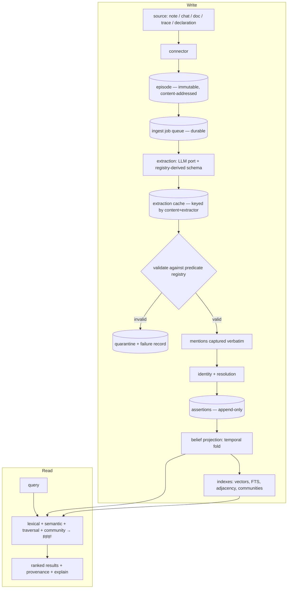
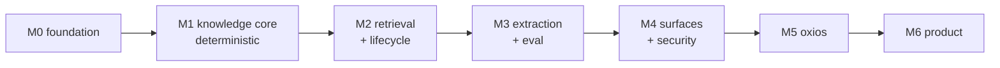

# oxibrain — A Second Brain for Humans and Agents

> **Version:** v1.0 (design, review-complete) · **Date:** 2026-08-11 · Supersedes v0.3, v0.2, v0.1
> **Status:** Design. Ready for milestone specs. Not yet implemented.
> **Authority:** Canonical design source of truth for oxibrain. Superseded only by a newer dated revision.
> Consumer projects (including `oxios`) adapt to this document, not the other way around.
> **Companion:** `doc/ECOSYSTEM.md` — how the oxi apps compose around oxibrain, and the cross-project roadmap.

---

## 0. TL;DR

**oxibrain is a standalone, local-first knowledge and memory system** — a second brain that stores what happened, extracts what it means, tracks how that changed over time, and answers questions about it. It runs on its own (CLI + MCP, no oxi ecosystem required) and embeds as a Rust library. `oxios`, `oximemo`, `oxiline`, Claude Desktop, and any other MCP client are **consumers of equal standing**.

Everything rests on one idea:

> **An immutable ledger of episodes, and a deterministic projection derived from it.**

Everything the brain *knows* — entities, relationships, beliefs, embeddings, indexes, rankings — is a **projection** of an append-only log. Nothing derived is precious: drop it and recompute. Nothing recorded is silently destroyed: forgetting adjusts *salience*; destruction is an explicit, audited **redaction**.

| Hard problem | How the ledger/projection split dissolves it |
|---|---|
| Provenance vs. forgetting | Provenance can't dangle — the ledger is never garbage-collected. Forgetting demotes salience; it does not delete truth. |
| Bad extraction | Re-extract with a better model, re-project. The ledger is unchanged; beliefs improve. |
| Wrong entity merges | Merges are data and mentions are retained → reversible by re-projecting. |
| Bi-temporality | The assertion log *is* transaction time. Belief tables cache the current slice. |
| Model / schema upgrades | A projection-version bump, not a data migration. |
| Auditability | "Why do you believe this?" is a join, always answerable. |

The invariant only holds if the projection is **deterministic** — same ledger, same projection, byte for byte. §5.6 specifies how, and §14.3 makes it an executable test. A design that claims rebuildability without that test is claiming nothing.

---

## 1. Product definition

### 1.1 What it does

- **Ingests** episodes — conversations, notes, documents, messages, agent traces.
- **Extracts** entities, relationships, and observations with an LLM, under a generated schema, every claim traceable to its source.
- **Tracks time** — what was true when, and when the system came to believe it.
- **Answers** via hybrid retrieval: lexical, semantic, multi-hop traversal, and thematic community search.
- **Serves** humans (CLI, later a UI) and agents (MCP, Rust API).

### 1.2 Who it is for, in order

1. **An individual** on a laptop — a personal knowledge base with an agent-native query surface.
2. **An agent runtime** (`oxios`, `oxicode` agents) needing durable, structured, temporally-aware memory instead of a text blob.
3. **A small team** sharing a self-hosted node, with per-space scoping and an audit trail.

(3) is why spaces, scoped capabilities, trust tiers, redaction, and audit are designed in rather than bolted on: cheap now, structurally expensive later.

### 1.3 What ships

One engine, three delivery shapes. Not "a crate", not "an all-in-one app".

| Artifact | Form | Audience |
|---|---|---|
| `oxibrain` crate | Rust library — the `Brain` facade | apps embedding a brain in-process |
| `oxibrain` binary | **one** executable: CLI, MCP server, and daemon as subcommands | standalone users, MCP clients, a team node |
| desktop app (M6) | a *brain* UI over the binary | users who want to see the graph |

v1 (M0–M5) ships **the crate and the binary**. The product must be complete with no GUI: `cargo install oxibrain && oxibrain init && oxibrain ingest ~/notes && oxibrain ask "…"`. A GUI required for the product to make sense would mean the CLI and MCP surfaces failed.

### 1.4 Boundary: oxibrain is not an editor

oxibrain **never owns authoring**. It does not edit markdown, manage a vault, or replace a note app. Files belong to whatever the user writes in — `oximemo`, Obsidian, VS Code — and oxibrain reads them through a connector.

```
oximemo · oxiline · oxios · Obsidian · VS Code    ← author here (owns the files)
                  ↓  vault connector (read-only, watched)
              oxibrain                             ← understands here
                  ↓  MCP · Rust API · CLI
   agents · Claude Desktop · brain UI (M6)         ← asks here
```

1. **Focus.** An editor is an enormous surface unrelated to the knowledge-graph value; building one means shipping a worse Obsidian.
2. **Reach.** Editor-agnosticism makes an Obsidian user a customer without changing their setup. Owning the editor makes them a non-customer.

One exception at M6: **quick capture** — one input that turns a passing thought into an episode. Capture is not authoring.

### 1.5 What "done" means for v1

- `cargo install oxibrain` → ingest → ask, with **zero** oxi-ecosystem dependencies.
- Any MCP client connects and gets the full tool surface, scoped.
- `oxios` runs its entire memory subsystem on oxibrain, with no memory code of its own.
- Every answer traces to source episodes with one command.
- Published eval results on public benchmarks; CI blocks regressions.

---

## 2. Goals and non-goals

### Goals (v1)

- **Standalone first.** No required dependency on any oxi crate. Ecosystem integrations are optional adapters behind feature flags.
- **Correctness over cleverness.** A confidently wrong fact is worse than a missing one. Every belief carries support, confidence, provenance.
- **Bi-temporal knowledge.** "When was it true" and "when did we believe it", both queryable.
- **Deterministic core, non-deterministic edge.** Storage, temporal logic, identity, resolution, and retrieval are deterministic and property-tested. Only extraction talks to an LLM, and its output is content-addressed and replayable.
- **Operable.** Migrations, backup/restore, health checks, telemetry, bounded resource use, crash-safe ingestion.
- **Multi-consumer safe.** Several applications share one brain without corrupting it.

### Non-goals (v1)

- An external graph database or any separate database process. Embedded SQLite only.
- A Python runtime anywhere.
- A hosted multi-tenant cloud service. A self-hosted single node is the ceiling.
- OCR / media understanding. Text in, text out; connectors may pre-transcribe.
- Multi-writer replication or consensus. Single writer; sync is post-v1 (§11.6).
- A polished GUI (M6).

---

## 3. Foundational principles

Invariants. Code violating one is wrong even if tests pass. Changing one requires revising this document.

### P1 — Ledger and projection

Episodes are **immutable and append-only**. Everything else — entities, statements, beliefs, embeddings, indexes, salience — is **derived** and reconstructible by replaying the ledger. `oxibrain reproject` is a supported, tested operation.

Two corollaries that make this real rather than aspirational:

- **The ledger is the only durable write path.** A manual `add_entity`, `add_statement`, `merge`, or `retract` writes a **declaration episode** into the ledger, and the resulting projection rows are derived from it like any other. Nothing a user asserts lives only in the projection, because reprojection would erase it.
- **The projection is a deterministic function of the ledger.** Not "equivalent", not "isomorphic" — byte-identical, guaranteed by content-derived identity (§5.6) and canonical processing order. This is testable, and §14.3 tests it.

### P2 — Assertions, not facts

The system never stores "X is true". It stores "**episode E asserted, via extractor R, that X held over interval I, with confidence c**". Truth is *computed* from the assertion set.

Corroboration, contradiction, retraction, confidence, and many-provenance become one mechanism instead of five features.

### P3 — Identity is stable; resolution is reversible

An entity's ID is permanent and independent of its names. Names, aliases, and merges are mutable data *about* it. Every assertion retains the **verbatim mention** it came from, so the entity layer can be re-resolved from scratch with no LLM call.

A bad merge is a re-projection away from fixed, never a data-loss event.

### P4 — Semantics live in the registry, not the prompt

Predicate meaning — object type, cardinality, temporality, symmetry, inverse, invalidation — is declared in a **versioned registry stored in the database**. The extraction schema, the validator, and the temporal engine all read that one source.

"Does asserting `works_on(Alice, Y)` close `works_on(Alice, X)`?" is answered by data, not an `if` buried in a pipeline.

### P5 — Forgetting is not deleting

Decay, compaction, and consolidation change **retrieval salience** and produce **derived episodes**. They never remove ledger rows. Destruction happens only through **redaction**: explicit, audited, cascading (§11.5).

### P6 — The engine is a library; every surface is an adapter

`oxibrain-core` knows nothing of MCP, HTTP, the CLI, or any UI. Anything reachable over MCP is reachable in-process, and vice versa.

### P7 — Ports at the boundary

LLM inference, embedding, and clock are **traits owned by oxibrain**. Providers are adapters behind feature flags. Standalone users install nothing extra; tests run with no network.

### P8 — One writer per store

Exactly one writing process, enforced by an advisory lock. Multi-application access goes through the daemon (§4.3). Concurrent writers with divergent in-memory indexes are designed out, not documented around.

---

## 4. Architecture

### 4.1 Layers

```
┌───────────────────────────────────────────────────────────────────────┐
│ SURFACES (adapters — no business logic)                               │
│  oxibrain-cli  ·  oxibrain-mcp (stdio · socket · HTTP)                │
│  Rust API (oxibrain crate)     ·  (M6) desktop UI                     │
├───────────────────────────────────────────────────────────────────────┤
│ oxibrain-core — the engine                                            │
│                                                                       │
│  ┌── Ingestion ────────────┐  ┌── Knowledge ────────┐  ┌── Retrieval ┐│
│  │ connectors → episodes   │  │ predicate registry  │  │ lexical     ││
│  │ durable job queue       │  │ temporal fold       │  │ semantic    ││
│  │ extraction (LLM port)   │  │ belief projection   │  │ traversal   ││
│  │ validation / quarantine │  │ identity+resolution │  │ communities ││
│  │ mention capture         │  │ merge / split       │  │ fusion(RRF) ││
│  │ consolidation           │  │ salience            │  │ context pack││
│  └───────────┬─────────────┘  └──────────┬──────────┘  └──────┬──────┘│
│              │                            │                    │       │
│  ┌───────────▼────────────────────────────▼────────────────────▼─────┐ │
│  │ oxibrain-store — the only thing that touches SQLite               │ │
│  │  ledger │ cache │ projection │ ops                                │ │
│  │  migrations · single-writer actor · reader pool · backup          │ │
│  └───────────────────────────────┬───────────────────────────────────┘ │
│  ┌───────────────────────────────▼───────────────────────────────────┐ │
│  │ oxibrain-index — embeddings, HNSW, FTS5/BM25, sqlite-vec, RRF     │ │
│  └───────────────────────────────────────────────────────────────────┘ │
├───────────────────────────────────────────────────────────────────────┤
│ PORTS (traits owned by oxibrain, implementations pluggable)           │
│  LlmPort · EmbeddingPort · ClockPort                                  │
│  adapters: http providers │ oxicode-ai │ local gguf │ MCP sampling │ fake│
└───────────────────────────────────────────────────────────────────────┘
```

### 4.2 Data flow



**Every arrow after `episode` is replayable.** Drop the projection and `reproject` rebuilds it with no LLM call, because extraction outputs are cached against the ledger.

### 4.3 Deployment modes

| Mode | Who runs it | Storage access | Use |
|---|---|---|---|
| **Embedded** | one host process links `oxibrain` | exclusive advisory lock | a single app, a CLI run, tests |
| **Daemon** (`oxibrain serve --daemon`) | background service owns the store | sole writer; clients speak MCP over socket / stdio / HTTP | several apps share one brain |
| **Read-only library** | any process | read-only connection, no index mutation | analytics, export |

Embedded mode fails fast with a clear error if a daemon holds the lock, and prints the command to attach instead. Two processes with independent in-memory HNSW indexes writing one SQLite file is a corruption path; the answer is a topology, not a mutex.

---

## 5. Data model

### 5.1 Four zones

The distinction that matters is **what it costs to lose each one**.

| Zone | Contents | Loss cost | Backup |
|---|---|---|---|
| **Ledger** | `spaces`, `episodes`, `episode_links` | irreplaceable | always |
| **Cache** | `extractions` (raw LLM responses), `summaries` (generated derived text) | rebuildable **with money and time** | default yes, `--no-cache` to skip |
| **Projection** | `entities`, `entity_keys`, `entity_merges`, `statements`, `assertions`, `mentions`, `beliefs`, `predicates`, `communities`, embeddings, FTS, adjacency | free to rebuild from ledger + cache | default no |
| **Ops** | `ingest_jobs`, `extraction_failures`, `audit_log`, `meta` | audit is irreplaceable; the rest is disposable | audit always |

v0.3 filed `extractions` under the ledger. That was wrong: it is the bulk of the bytes (≈2 KB × episode count) and it is regenerable, just not for free. A separate zone makes the backup tradeoff explicit instead of hiding a 200 MB cache inside "irreplaceable".

### 5.2 Ledger types

```rust
/// A namespace and isolation boundary. All queries are space-scoped.
pub struct Space { pub id: SpaceId, pub name: String, pub created_at: Timestamp }

/// The atom of record. Immutable once written.
pub struct Episode {
    pub id: EpisodeId,              // hash-derived (§5.6) — NOT a random ULID
    pub space: SpaceId,
    pub seq: u64,                   // monotonic ingest order; defines canonical replay order
    pub content_hash: ContentHash,  // BLAKE3 over normalized content
    pub content: String,
    pub source: SourceRef,
    pub trust: TrustTier,           // Trusted | SemiTrusted | Untrusted   (§11.3)
    pub kind: EpisodeKind,          // Primary | Declaration | Derived     (§5.3)
    pub occurred_at: Timestamp,     // when it happened in the world
    pub ingested_at: Timestamp,     // when the system received it
    pub redacted_at: Option<Timestamp>,
}
```

`SourceRef` — `Conversation | Note{path} | Document{uri} | Message | AgentTrace | Declaration | Derived{of}`.

### 5.3 Episode kinds — closing the derived-episode loop

v0.3 said consolidation and community summaries write derived episodes into the ledger. Taken literally that breaks P1 twice: derived text is LLM-generated (non-deterministic), and if it is re-extracted it feeds back into the graph that produced it. `EpisodeKind` closes both holes.

| Kind | Written by | Re-extracted? | Determinism |
|---|---|---|---|
| `Primary` | connectors, `ingest` | yes | content comes from outside; deterministic input |
| `Declaration` | manual API/CLI/MCP writes | **no** — it carries structured claims, not prose | fully deterministic |
| `Derived` | consolidation, community summaries | **never** | generated text is cached in the `summaries` cache, keyed by `(kind, member_set_hash, extractor_id)`; reprojection reuses the cache and only regenerates on an explicit `--regenerate-summaries` |

So: derived episodes are searchable, quotable, and provenance-carrying (they link to their sources), but they are **terminal** — no assertion is ever extracted from one, so the feedback loop cannot exist. Regeneration is an explicit, user-initiated act that produces a new cache entry with a new extractor id, leaving the old one intact and comparable.

`Declaration` episodes are what make P1's first corollary work. `add_statement(alice, works_on, projectx, valid_from: …)` writes a declaration episode whose content is the canonical JSON of the claim; the assertion's provenance points at it. Reprojection replays declarations exactly, so user knowledge survives a rebuild — and user merges (§8.3) survive for the same reason.

### 5.4 Knowledge types

```rust
/// Opaque, permanent identity. Names live in `EntityKey`, not here (P3).
pub struct Entity {
    pub id: EntityId,               // derived (§5.6), stable across renames
    pub space: SpaceId,
    pub ty: EntityTypeRef,
    pub canonical_key: Option<EntityKeyId>,
    pub created_at: Timestamp,
    pub merged_into: Option<EntityId>,   // redirect; lookups follow the chain
}

/// A (type, normalized name) handle. Aliases are additional keys on one entity.
pub struct EntityKey {
    pub id: EntityKeyId,
    pub space: SpaceId,
    pub entity: EntityId,
    pub ty: EntityTypeRef,
    pub normalized: String,         // NFKC + casefold + whitespace collapse
    pub surface: String,            // as written
    pub origin: KeyOrigin,          // Extracted | UserDeclared | Imported
}

/// Merges are data, so they replay and reverse (P3).
pub struct EntityMerge {
    pub loser: EntityId,
    pub winner: EntityId,
    pub decided_by: MergeDecision,  // Rule{score} | User | Import
    pub provenance: EpisodeId,      // a Declaration episode for user merges
    pub evidence: Vec<MentionId>,
    pub decided_at: Timestamp,
    pub undone_at: Option<Timestamp>,
}

/// An atemporal proposition. Content-addressed → deduplicated by construction.
/// Relations and observations are the same shape; only `object` differs.
pub struct Statement {
    pub id: StatementId,            // hash(space, subject, predicate, object)
    pub space: SpaceId,
    pub subject: EntityId,
    pub predicate: PredicateRef,
    pub object: Object,             // Entity(EntityId) | Literal(TypedValue)
}

/// "Episode E, via extractor R, claimed S held over I, with confidence c."
/// The append-only unit of evidence (P2). Transaction time lives here.
pub struct Assertion {
    pub id: AssertionId,            // hash(statement, episode, extractor, claim)
    pub statement: StatementId,
    pub episode: EpisodeId,         // provenance — mandatory, FK-enforced
    pub extractor: Option<ExtractorId>,  // None = manual declaration
    pub polarity: Polarity,         // Affirm | Deny
    pub claimed_from: Timestamp,    // TIME_MIN when unbounded (§6.2)
    pub claimed_to: Timestamp,      // TIME_MAX when still true
    pub confidence: f32,
    pub recorded_at: Timestamp,     // transaction time — when we learned it
    pub retracted_at: Option<Timestamp>, // transaction-time end
}

/// The verbatim text this assertion came from — the key to reversible resolution.
pub struct Mention {
    pub id: MentionId,
    pub assertion: AssertionId,
    pub role: MentionRole,          // Subject | Object
    pub surface: String,            // verbatim, as it appeared
    pub span: (u32, u32),           // byte offsets into the episode
    pub resolved_to: Option<EntityId>,
    pub method: ResolutionMethod,   // ExactKey | Alias | Lexical{score} | Embedding{score} | New | User
}

/// Current-slice cache of the temporal fold. Fully derived.
pub struct Belief {
    pub statement: StatementId,
    pub valid_from: Timestamp,      // NOT NULL — sentinel, never NULL (§6.2)
    pub valid_to: Timestamp,
    pub support: Support,           // affirm/deny counts, distinct episodes, trust mix
    pub confidence: f32,            // computed (§6.5)
    pub status: BeliefStatus,       // Active | Superseded | Contradicted | Retracted
}
```

There is intentionally **no `Fact` type** and no physical `Relation` / `Observation`. Those are API renderings:

| API view | Physical | Rationale |
|---|---|---|
| `Relation` | `Statement` where `object = Entity(_)` | keeps MCP / `mcp-knowledge-graph` vocabulary |
| `Observation` | `Statement` where `object = Literal(_)` | same |
| `Fact` | `Statement` + `Belief` + top provenance | what a caller actually wants back |

One physical model, three familiar names, nothing to keep in sync.

### 5.5 Predicate registry (P4)

```rust
pub struct PredicateDef {
    pub name: String,                   // "works_on"
    pub object_kind: ObjectKind,        // Entity(EntityTypeRef) | Literal(LiteralType) | Enum(Vec<String>)
    pub subject_types: Vec<EntityTypeRef>,
    pub cardinality: Cardinality,       // Functional | MultiValued
    pub temporality: Temporality,       // Static | Interval | Point
    pub invalidation: Invalidation,     // Supersede | Coexist | ExplicitOnly
    pub symmetric: bool,
    pub inverse_of: Option<String>,
    pub description: String,            // fed verbatim into the extraction prompt
    pub examples: Vec<String>,          // few-shot material
    pub deprecated_by: Option<String>,
}
```

`LiteralType` is typed, not free JSON: `Text | Date | DateTime | Quantity{unit} | Number | Bool | Enum`. Dates especially must be typed or `timeline` degrades to string comparison.

**Shipping ontology `core/v1`** — entity types `Person, Organization, Project, Concept, Place, Event, Artifact, Document, Code, Task`; ~40 predicates. It is **data seeded by migration**, so projects extend it (`oxibrain predicate add`) without forking code.

**Versioning, and why it matters more than it looks.** `ExtractorId` includes the registry version (§7.5), so a naive bump invalidates every cached extraction and forces a full, paid re-extraction of the corpus. Adding one predicate must not cost that. Therefore:

- **Major** version — changing or removing an existing predicate's semantics. Invalidates the cache; re-extraction required.
- **Minor** version — adding a new predicate or entity type. **Does not** invalidate. Existing extractions stay valid (they simply never used the new predicate); new episodes and explicit `reextract --since` pick it up.

`ExtractorId` therefore hashes the registry **major** version only.

The registry drives, from one definition: the JSON Schema handed to the LLM, the post-extraction validator, the temporal upsert rules, traversal semantics (inverse/symmetric), and the generated ontology docs.

### 5.6 Deterministic identity

P1's second corollary requires that the same ledger always produces the same projection — including the same IDs. Random ULIDs make that impossible, so every projection ID is **content-derived**, and the derivation is acyclic:

```
EpisodeId    = blake3(space, content_hash, source_ref, occurred_at)
EntityId     = blake3(space, entity_type, first_episode_id, first_span_start)
EntityKeyId  = blake3(entity_id, normalized, ty)
StatementId  = blake3(space, subject_entity_id, predicate, object_repr)
AssertionId  = blake3(statement_id, episode_id, extractor_id, claim_repr)
MentionId    = blake3(assertion_id, role, span)
```

No cycle: entities are keyed by *where they were first mentioned* (a location in an immutable, content-addressed episode), not by anything downstream of themselves. A rename or a merge never changes an `EntityId`, so P3 holds. Entities created by declaration use the declaration episode and span zero.

"First mention" is well defined because replay has a **canonical order**: `(episode.seq, extractor_id, statement_index_within_response)`. Incremental ingestion follows the same order by construction, since `seq` is assigned at ingest. Reprojection therefore reproduces the incremental result exactly — which is what §14.3 asserts and tests.

`object_repr` and `claim_repr` are canonical serializations: sorted keys, normalized numbers, RFC-3339 UTC timestamps. Canonicalization is a single shared function; a bug in it is a determinism bug, so it has its own property tests.

### 5.7 Schema sketch

```sql
PRAGMA journal_mode=WAL;
PRAGMA foreign_keys=ON;
PRAGMA busy_timeout=5000;

-- ── Ledger ────────────────────────────────────────────────────────────
CREATE TABLE spaces (
  id TEXT PRIMARY KEY, name TEXT NOT NULL UNIQUE, created_at INTEGER NOT NULL
);

CREATE TABLE episodes (
  id           TEXT PRIMARY KEY,
  space_id     TEXT NOT NULL REFERENCES spaces(id),
  seq          INTEGER NOT NULL,          -- canonical replay order
  content_hash BLOB NOT NULL,
  content      TEXT NOT NULL,
  source_kind  TEXT NOT NULL,
  source_ref   TEXT,
  trust        TEXT NOT NULL,
  kind         TEXT NOT NULL,             -- Primary | Declaration | Derived
  occurred_at  INTEGER NOT NULL,
  ingested_at  INTEGER NOT NULL,
  redacted_at  INTEGER,
  UNIQUE (space_id, content_hash),        -- idempotent ingest, by construction
  UNIQUE (space_id, seq)
);

CREATE TABLE episode_links (              -- derived → sources, and note revisions
  from_episode TEXT NOT NULL REFERENCES episodes(id),
  to_episode   TEXT NOT NULL REFERENCES episodes(id),
  rel          TEXT NOT NULL,             -- summarizes | revises | replies_to
  PRIMARY KEY (from_episode, to_episode, rel)
);

-- ── Cache (rebuildable, but not free) ─────────────────────────────────
CREATE TABLE extractions (
  episode_id    TEXT NOT NULL REFERENCES episodes(id),
  extractor_id  TEXT NOT NULL,
  response_hash BLOB NOT NULL,
  raw_response  TEXT NOT NULL,
  created_at    INTEGER NOT NULL,
  PRIMARY KEY (episode_id, extractor_id)  -- re-extraction is a no-op
);

CREATE TABLE summaries (                  -- derived-episode text, §5.3
  scope_kind      TEXT NOT NULL,          -- consolidation | community
  member_set_hash BLOB NOT NULL,
  extractor_id    TEXT NOT NULL,
  text            TEXT NOT NULL,
  created_at      INTEGER NOT NULL,
  PRIMARY KEY (scope_kind, member_set_hash, extractor_id)
);

-- ── Projection ────────────────────────────────────────────────────────
CREATE TABLE entities (
  id            TEXT PRIMARY KEY,
  space_id      TEXT NOT NULL REFERENCES spaces(id),
  type_name     TEXT NOT NULL,
  canonical_key TEXT REFERENCES entity_keys(id) DEFERRABLE INITIALLY DEFERRED,
  created_at    INTEGER NOT NULL,
  merged_into   TEXT REFERENCES entities(id)
);

CREATE TABLE entity_keys (
  id         TEXT PRIMARY KEY,
  space_id   TEXT NOT NULL REFERENCES spaces(id),
  entity_id  TEXT NOT NULL REFERENCES entities(id) ON DELETE CASCADE,
  type_name  TEXT NOT NULL,
  normalized TEXT NOT NULL,
  surface    TEXT NOT NULL,
  origin     TEXT NOT NULL
);
CREATE UNIQUE INDEX idx_entity_key_unique
  ON entity_keys(space_id, type_name, normalized);
CREATE INDEX idx_entity_key_entity ON entity_keys(entity_id);

CREATE TABLE entity_merges (
  id TEXT PRIMARY KEY,
  loser_id TEXT NOT NULL REFERENCES entities(id),
  winner_id TEXT NOT NULL REFERENCES entities(id),
  decided_by TEXT NOT NULL, score REAL,
  provenance TEXT REFERENCES episodes(id),
  decided_at INTEGER NOT NULL, undone_at INTEGER
);

CREATE TABLE statements (
  id             TEXT PRIMARY KEY,
  space_id       TEXT NOT NULL REFERENCES spaces(id),
  subject_id     TEXT NOT NULL REFERENCES entities(id),
  predicate      TEXT NOT NULL,
  object_entity  TEXT REFERENCES entities(id),
  object_literal TEXT,                    -- canonical JSON, typed per registry
  CHECK ((object_entity IS NULL) != (object_literal IS NULL))
);
CREATE INDEX idx_stmt_subject ON statements(space_id, subject_id, predicate);
CREATE INDEX idx_stmt_object  ON statements(space_id, object_entity, predicate);

CREATE TABLE assertions (
  id           TEXT PRIMARY KEY,
  statement_id TEXT NOT NULL REFERENCES statements(id) ON DELETE CASCADE,
  episode_id   TEXT NOT NULL REFERENCES episodes(id),   -- provenance, enforced
  extractor_id TEXT,                                    -- NULL = manual declaration
  polarity     INTEGER NOT NULL,                        -- +1 affirm, -1 deny
  claimed_from INTEGER NOT NULL,                        -- sentinel, never NULL
  claimed_to   INTEGER NOT NULL,
  confidence   REAL NOT NULL,
  recorded_at  INTEGER NOT NULL,
  retracted_at INTEGER
);
CREATE INDEX idx_assert_stmt ON assertions(statement_id, recorded_at);
CREATE INDEX idx_assert_ep   ON assertions(episode_id);

CREATE TABLE beliefs (                    -- cache of the current-time fold
  statement_id TEXT NOT NULL REFERENCES statements(id) ON DELETE CASCADE,
  valid_from   INTEGER NOT NULL,          -- NOT NULL: PK correctness (§6.2)
  valid_to     INTEGER NOT NULL,
  status       TEXT NOT NULL,
  confidence   REAL NOT NULL,
  support_json TEXT NOT NULL,
  PRIMARY KEY (statement_id, valid_from)
);

-- ── Ops ───────────────────────────────────────────────────────────────
CREATE TABLE ingest_jobs (
  id TEXT PRIMARY KEY, episode_id TEXT NOT NULL REFERENCES episodes(id),
  extractor_id TEXT NOT NULL, state TEXT NOT NULL,
  session_hint TEXT,                      -- for MCP sampling eligibility (§12.3)
  attempts INTEGER NOT NULL DEFAULT 0, last_error TEXT,
  lease_until INTEGER, created_at INTEGER NOT NULL, updated_at INTEGER NOT NULL
);
CREATE INDEX idx_jobs_ready ON ingest_jobs(state, lease_until);
```

Two schema notes that were bugs in v0.3 and are fixed here:

1. **`beliefs.valid_from` is `NOT NULL`.** SQLite permits NULLs in a `PRIMARY KEY` column — a historical quirk that would have allowed silent duplicate rows for every belief with an unknown start. Open intervals use sentinels (§6.2), never NULL.
2. **`entity_keys` is defined**, and the `entities ↔ entity_keys` cycle is `DEFERRABLE INITIALLY DEFERRED` so a two-row insert commits atomically.

`ON DELETE CASCADE` appears only within the projection. No cascade crosses from the ledger into knowledge; redaction runs its own explicit procedure (§11.5).

### 5.8 Migrations

- `PRAGMA user_version` as the counter; ordered, forward-only, embedded `.sql` plus optional Rust steps.
- Every migration has an up-test against a fixture database of the previous version; CI runs the full chain from v1.
- Two version numbers in `meta`: `ledger_schema_version` (migrated carefully) and `projection_version` (bumping it triggers a **rebuild**, not a migration — P1's dividend).
- Opening a store newer than the binary is a hard error naming the required version.

---

## 6. Temporal and belief semantics

### 6.1 Two time axes

| Axis | Where it lives | Question |
|---|---|---|
| **Valid time** | `assertions.claimed_from/_to` → `beliefs.valid_from/_to` | "Was X true on 2024-03-01?" |
| **Transaction time** | `assertions.recorded_at / retracted_at` | "What did the brain believe on 2024-03-01?" |

Transaction time needs no history table: **the assertion log is the transaction-time record.** Belief as of transaction time *S* is the fold over assertions with `recorded_at <= S AND (retracted_at IS NULL OR retracted_at > S)`. `beliefs` caches only `S = now`, which is what nearly every query wants; historical belief replays the log. Correct, cheap enough, and with no second write path to keep consistent.

### 6.2 Sentinel time, not `Option<Timestamp>`

Open intervals use `TIME_MIN` / `TIME_MAX` (`i64::MIN + 1` / `i64::MAX - 1`) rather than NULL or `Option`. Three reasons, in order of importance:

1. **Primary-key correctness** — see §5.7 note 1.
2. **Interval algebra without special cases.** Every comparison is a plain integer comparison; the fold has no four-way NULL branching, which is where interval bugs live.
3. **Index usability** — a range scan works; `IS NULL OR` does not.

### 6.3 The fold

For one statement, in `recorded_at` order:

1. Filter to assertions visible at *S*.
2. Partition by polarity. Denials clip affirming intervals; a denial with no interval clips from its `recorded_at`.
3. Merge overlapping/adjacent affirming intervals into disjoint belief intervals.
4. Apply the predicate's cardinality and invalidation (§6.4).
5. Compute confidence (§6.5) and status.

```rust
fn fold(def: &PredicateDef, assertions: &[Assertion], at: Timestamp) -> Vec<Belief>
```

A pure function, therefore property-testable, and it is: *intervals are disjoint and ordered*, *retraction is monotone*, *fold(prefix) then fold(suffix) equals fold(whole)*, *fold is idempotent* — all proptest properties gating CI.

### 6.4 Invalidation is declared, never guessed

| `cardinality` | `invalidation` | New assertion on the same subject+predicate |
|---|---|---|
| `Functional` | `Supersede` | closes the previous interval at the new `claimed_from` |
| `MultiValued` | `Coexist` | adds a parallel interval; nothing closes |
| any | `ExplicitOnly` | only an explicit `Deny` closes an interval |

`employed_by` is `Functional/Supersede`. `works_on` is `MultiValued/Coexist` — a person works on several projects, and the naive "new value closes the old" rule destroys true facts. `born_in` is `Static`: a second value raises a **contradiction**, not a supersession.

Contradiction is a first-class outcome. `BeliefStatus::Contradicted` keeps both intervals, surfaces both provenances, and downranks the statement until resolved. `oxibrain contradictions` lists them; resolving writes a `UserDeclared` assertion. **The system never silently picks a winner.**

### 6.5 Confidence

```
confidence = calibrate(extractor) · corroboration · trust · recency_of_support
```

- `calibrate(extractor)` — per-extractor multiplier measured by the eval harness (§14). An unmeasured extractor gets a conservative prior.
- `corroboration` — saturating in the count of **distinct episodes** affirming it. Ten assertions from one episode are one episode's evidence; this is why provenance is 1:N.
- `trust` — weighted by the trust tier of supporting episodes (§11.3).
- `recency_of_support` — `Interval` predicates only.

Manual declarations bypass this at `1.0`: a user statement always outranks an extracted one.

### 6.6 Temporal queries

- `timeline(entity, [range])` — belief intervals touching the range, with change points.
- `as_of(query, valid_time, [transaction_time])` — any read pinned on either axis.
- `diff(t1, t2)` — what the brain learned, changed its mind about, or forgot between two transaction times. The audit primitive, and the demo that sells the product.

---

## 7. Ingestion and extraction

### 7.1 Stages

```
connector → episode (dedup by content hash) → job enqueued → lease → chunk
  → extract (LLM port) → cache raw response → parse → validate against registry
  → capture mentions → resolve identity → write assertions → fold beliefs
  → update indexes → job done
```

Each stage is separately restartable with its state in `ingest_jobs`. A crash resumes from the last committed stage; at worst one LLM call repeats, and the response cache usually prevents even that.

### 7.2 The transaction rule

**No LLM call, no network call, and no embedding computation ever happens inside a database transaction.** Stages compute outside, then commit a short batched write. With a single writer actor (§13.1), a stalled provider must never block readers — verified by a test that installs a deliberately slow provider and asserts read latency stays inside budget.

### 7.3 Idempotency

Three layers, each a database constraint rather than a code path:

1. `UNIQUE(space_id, content_hash)` on episodes — re-ingesting a file is a no-op.
2. `PRIMARY KEY(episode_id, extractor_id)` on extractions — re-extraction is a no-op.
3. Content-derived `AssertionId` (§5.6) — replay converges instead of accumulating.

Re-ingesting a directory nightly is therefore safe and cheap, which is what people actually do.

### 7.4 Extraction contract

- **Output is schema-forced**, not prompted-and-hoped. Preference order: provider structured-output / JSON-schema → forced tool call → constrained decoding. The port declares its capability; the mechanism is recorded in `ExtractorId`.
- **The schema is generated from the registry**, so prompt/model drift is impossible by construction.
- **Validation rejects**: unknown predicates, subject/object type violations, cardinality violations, malformed or non-typed literals, spans that do not exist in the source, and **any entity mention not present verbatim in the episode**.
- **Repair loop**: one retry with validator errors appended, then partial acceptance — valid statements kept, invalid ones filed in `extraction_failures` with the raw response. A bad batch never blocks a good one and never disappears silently.
- **Chunking with overlap** for long episodes; cross-chunk coreference is handled at resolution, not in the prompt.

**What the verbatim-mention rule does and does not buy.** It structurally prevents the model from *inventing an entity* — a fabricated name is not in the text, so the claim is dropped. It does **not** prevent the model from asserting a false *relationship* between two entities that both genuinely appear. v0.3 called this "the anti-hallucination gate", which overstated it. The metric is therefore split (§14.2): fabricated-entity rate is a structural hard zero; relation precision is an ordinary measured quantity that must be defended by evaluation, not by architecture.

### 7.5 Extractor identity and upgrades

```
ExtractorId = blake3(model_id, prompt_version, registry_major_version, mechanism)
```

Upgrading the model is a normal operation, not a migration: `oxibrain reextract --extractor <new>` over the ledger. Old assertions remain, new ones are added, both are comparable on the eval suite, and promoting — or demoting — the new extractor is a config change.

### 7.6 Cost and backpressure

- Extraction is **queued and rate-limited**, never synchronous with a user write unless `mode: sync` is requested.
- Budgets: max concurrent calls, max spend/day, max tokens/episode. On exhaustion the queue holds; it never drops.
- Profiles: `realtime` (extract now), `batched` (default — on an interval), `nightly` (consolidation window, cheapest tier).
- "Cheap first pass, expensive second pass" is expressible precisely because re-extraction has no side effects: run a small model over everything, escalate high-salience episodes.

---

## 8. Identity and resolution

The hardest component, specified accordingly.

### 8.1 Pipeline

1. **Normalize** — NFKC, casefold, collapse whitespace, strip honorifics and legal suffixes per entity type.
2. **Block** — candidates from exact `entity_keys` hits, FTS5/trigram prefix matches, and embedding kNN restricted to the same type. Blocking is what keeps this sublinear as the graph grows.
3. **Score** — weighted: exact key, alias, string distance (Jaro-Winkler), embedding similarity, **type agreement (hard gate)**, and **graph context overlap** (shared neighbors). Context overlap is what separates two people named "Kim", and it costs one adjacency lookup.
4. **Decide** on dual thresholds:
   - `≥ τ_high` → link to the existing entity.
   - `≤ τ_low` → create a new entity with this mention as its first key.
   - between → **create a new entity and record a merge candidate.** Never guess. Candidates surface in `oxibrain review` and the `review_merges` tool.
5. **Record the mention** verbatim with method and score, always.

### 8.2 Embeddings are a secondary signal for names

Embedding similarity over short proper nouns is weak; TF-IDF over a two-word name is close to noise. So:

- Name matching is **primarily lexical**. Embeddings are secondary — weighted low for `Person` / `Organization`, higher for `Concept`, where paraphrase is normal.
- Entity embeddings are computed over a **name + type + top-observations** context string, never a bare name.
- Thresholds are **per entity type and per embedding provider**, stored in config with defaults derived from the eval harness — not constants that silently mean different things on different backends.

### 8.3 Merge and split

- `merge(a, b)` writes an `EntityMerge` and sets `merged_into`; lookups follow the redirect chain, path-compressed on read. Nothing is rewritten.
- `split(merge_id)` sets `undone_at` and re-runs resolution **for the affected mentions only**, using stored surface forms. Because P3 keeps every mention, this is exact rather than best-effort.
- **User merges are declarations** (§5.3), so reprojection replays them and never re-litigates them.

---

## 9. Retrieval

### 9.1 Modes

| Mode | Mechanism | Returns |
|---|---|---|
| `lexical` | FTS5/BM25 over episodes + statement renderings | episodes, statements |
| `semantic` | vector kNN (sqlite-vec persisted, HNSW in memory) | episodes, entities, statements |
| `graph` | bounded traversal over the belief-filtered edge set | entities, paths, subgraphs |
| `community` | map-reduce over community summaries (§9.4) | themes, with member drill-down |
| `hybrid` (default) | fused with RRF | ranked mixed results |

### 9.2 Truth and salience are different things

PageRank/co-access importance, decay, and access frequency are **ranking signals only**. They never affect whether something is believed. `Belief.confidence` and retrieval score are separate fields computed by separate code, and both are returned so a caller can tell them apart.

### 9.3 Traversal as a core API

```rust
pub struct TraversalSpec {
    pub start: Vec<EntityId>,
    pub max_depth: u8,               // hard cap 5
    pub max_nodes: u32,              // hard cap, default 256
    pub predicates: PredicateFilter, // allow/deny; follows inverse/symmetric
    pub direction: Direction,        // Out | In | Both
    pub valid_at: Option<Timestamp>, // only edges believed at this time
    pub min_confidence: f32,
    pub strategy: Strategy,          // Bfs | ShortestPath{to}
}
```

Think-on-Graph is a *policy* over this primitive: expand, read the subgraph, choose where to go next. An in-process agent and an MCP client drive the same call. Every traversal is bounded on depth, node count, and wall time — an unbounded walk driven by an LLM loop is a resource-exhaustion bug waiting to happen.

### 9.4 Communities — the thematic layer

Entity-centric retrieval answers *"what do I know about Alice?"* It cannot answer *"what have I been working on this year?"* — a question with no entity to anchor on. The fix, from GraphRAG: cluster the entity graph, summarize each cluster, answer broad questions from summaries.

Two adjustments for an incremental local system:

- **Label propagation, not Leiden.** Leiden is a batch algorithm that re-clusters the world; label propagation updates incrementally, which is what a continuously-ingesting brain needs. (Graphiti made the same choice for the same reason.)
- **Summaries are `Derived` episodes with cached text** (§5.3). Searchable, quotable, provenance-carrying — and *terminal*, so nothing is ever extracted from them and the feedback loop that would break P1 cannot form.

| Shape | Anchored on | Answers |
|---|---|---|
| `local` (default) | entities from the query | "when did we decide on HNSW?" |
| `global` | community summaries, map-reduced | "what themes ran through my work in Q2?" |

Clustering is deterministic (label propagation with a fixed tie-break on entity id and a fixed iteration cap); only the summary *text* comes from an LLM, and that is cached. Recomputation runs in the consolidation window, never on the write path.

### 9.5 Context assembly

The tiered-memory idea (Hot/Warm/Cold) becomes a **packing policy**, not a storage layout. `assemble_context(query, token_budget)` returns pinned facts, high-salience beliefs, the relevant neighborhood, and recent episodes, packed to budget with provenance attached. Agent runtimes call this instead of implementing recall heuristics — the single function that lets `oxios` delete its memory code.

Worth stating plainly: **this is reconstruction, not retrieval.** The context is composed on demand for *this* query from beliefs, neighborhoods, and episodes; it is not a stored blob being fetched. That is the distinction between graph memory and vector memory, and the reason `assemble_context` is a primitive rather than a wrapper over `query`.

### 9.6 Explainability

Every result carries `provenance: Vec<EpisodeRef>` and an optional `explain` block: which mode retrieved it, its rank in each list, the fused score, the supporting assertions, and the confidence breakdown. `oxibrain why <statement>` prints it. For a team deployment this is not a nicety; it is what makes the system auditable.

---

## 10. Memory lifecycle

| Process | Does | Must not | Deterministic? |
|---|---|---|---|
| **Salience decay** | lowers retrieval weight of unused material | delete anything | yes |
| **Consolidation** (`dream`) | clusters related episodes, writes a `Derived` episode linked to its sources | overwrite or remove sources; be re-extracted | clustering yes, summary text cached |
| **Compaction** | moves cold episode content to a compressed column, keeping row, hash, links | break provenance | yes |
| **Retention** | per-space policy; expiry moves content to cold storage; removal requires redaction | run without an audit entry | yes |

Consolidation writing a derived episode instead of mutating memory is the key departure from the inherited `dream`, which called `forget()` on merged-away entries. A summary is a new node linked to its sources: the summary is queryable, the sources remain, provenance chains through, and retrieval prefers the summary because salience says so — not because the sources are gone.

Compaction stores compressed content **in SQLite**, not in an external blob store. v0.3 proposed a `BlobPort`; that is an entire storage abstraction bought for a v2 problem, and it is cut.

---

## 11. Security, tenancy, trust

### 11.1 Spaces

Every episode, entity, statement, and query is scoped. Spaces are hard boundaries: no query, traversal, or **write** crosses one.

**A space is a privacy boundary, never an application boundary.** Do not create one per consuming app. Several apps writing to one space is the entire point — the brain can only connect last week's note to a Tuesday routine to yesterday's agent session if they land together. Apps are distinguished by `SourceRef`, a *label*, not a boundary.

**Cross-space reference is post-v1.** Some entities are genuinely global (a language, a public company), but a `shared` space only helps if *resolution* may read across the boundary, which contradicts a hard boundary. The v2 rule, stated now so the schema does not preclude it: resolution may consult `shared` as an additional **read-only candidate source**; writes never cross; a local entity linked to a shared one records that link explicitly. Not implemented in v1.

### 11.2 Capabilities

```rust
pub struct Scope {
    pub spaces: Vec<SpaceId>,
    pub caps: CapabilitySet,        // Read | Write | Ingest | Sample | Admin | Redact
    pub predicate_filter: Option<PredicateFilter>,   // e.g. hide `health_*`
    pub entity_type_filter: Option<Vec<EntityTypeRef>>,
    pub expires_at: Option<Timestamp>,
}
```

Tokens: `oxibrain token issue --space work --caps read,query --expires 30d`. MCP clients present one. **This is an M4 gate, not an open question** — the server does not ship without it. An unauthenticated daemon is acceptable only over a Unix socket with filesystem permissions, behind an explicit flag with a startup warning.

`Sample` is a distinct capability, and §12.3 explains why it must be.

### 11.3 Trust tiers and prompt injection

`ingest` runs an LLM over arbitrary text, and that text can contain instructions.

| Tier | Source | Treatment |
|---|---|---|
| `Trusted` | user-authored notes, direct declarations | full weight |
| `SemiTrusted` | own conversations, agent traces | full weight, flagged |
| `Untrusted` | web pages, imported documents, third-party messages | content fenced and marked as data; assertions get reduced trust weight and are **excluded from `assemble_context` by default** unless corroborated by a trusted episode |

Additionally: extraction output is data, never executed; validated mentions must appear verbatim (§7.4), which structurally blocks an injected instruction from conjuring an entity; and assertions from a single untrusted episode can never alone flip a belief with trusted support.

### 11.4 Audit

Append-only `audit_log` of every write, redaction, merge, token issue, scope grant, sampling authorization, and config change: actor, scope, operation, target, timestamp. Not rebuildable, so it backs up with the ledger.

### 11.5 Redaction — the only true delete

`redact(target, reason)`, where target is an episode, an entity, or a predicate-scoped subset:

1. Resolve the closure: episodes, extractions, summaries, mentions, assertions, and statements left unsupported.
2. Write the audit entry with the reason — **before** acting.
3. Overwrite `content`, `raw_response`, and summary `text` with a tombstone; keep row, id, hashes, timestamps.
4. Delete affected mentions and assertions; re-fold beliefs; delete statements with zero remaining support.
5. Rebuild affected indexes and communities; verify no orphans (`oxibrain doctor --check-orphans`).

`redact --dry-run` prints the closure first. Redaction is idempotent and reports exactly what it removed. "Forget this person entirely" is a supported, tested operation — for a personal brain a matter of dignity, for a team deployment a compliance requirement.

### 11.6 At rest, in transit, across devices

- Optional whole-database encryption (SQLCipher) behind a feature flag, key from the OS keychain. Off by default because it complicates backup; documented.
- HTTP is loopback-only by default; a non-loopback bind requires TLS and refuses to start without it.
- **Sync is post-v1**, and the schema is ready: content-derived ids, content hashes, an append-only ledger, and a rebuildable projection. The mechanism will be **ledger log shipping** (append-only, content-addressed, commutative — the easy case) plus **Loro** (Rust CRDT, stable 1.x, compact encoding) for the mutable slices needing real merge semantics: user merges, resolutions, config. Derived state is never synced; each device reprojects. P1 paying off a third time.

---

## 12. Interfaces

### 12.1 Rust API

```rust
let brain = Brain::open(BrainConfig::at("~/.oxi/brain")).await?;   // embedded
let brain = Brain::connect("unix:///run/oxibrain.sock").await?;    // daemon

let ep  = brain.ingest(Episode::note("meeting.md", text)).await?;
let ctx = brain.assemble_context("what did we decide about auth?", 3_000).await?;
let ans = brain.query(Query::hybrid("auth decision").as_of(date)).await?;
let sub = brain.traverse(TraversalSpec::from(entity).depth(2)).await?;
brain.declare(Statement::new(alice, "works_on", projectx))
     .valid_from(date).await?;                                     // → Declaration episode
```

`Brain` is one trait in both modes: a consumer changes topology by changing one line. That is the whole point of P6.

### 12.2 MCP surface

| Tool | Caps | Notes |
|---|---|---|
| `search` | Read | hybrid / lexical / semantic / community; `as_of` supported |
| `recall` | Read | `assemble_context` — the per-turn call for agents |
| `get_entity` | Read | entity + current beliefs + aliases + neighbors |
| `traverse` | Read | bounded subgraph; ToG driver |
| `timeline` | Read | belief intervals over a range |
| `why` | Read | provenance and confidence breakdown |
| `ingest` | Ingest | protocol-level long-running task |
| `remember` | Write | one-shot ingest + sync extraction, for short user facts |
| `declare` | Write | deterministic entity/statement writes, no LLM |
| `retract` | Write | writes a denying assertion |
| `merge_entities` / `review_merges` | Write | resolution maintenance |
| `redact` | Redact | destructive; separate capability on purpose |

Resources: `space://`, `entity://{id}`, `episode://{id}`, `graph://{entity}?depth=n`.

**Protocol:** adopt `rmcp`, the official Rust SDK, implementing stable **MCP 2026-07-28** with backward compatibility to 2025-11-25. Reusing `oxios-mcp` was never viable — it is a *client* with no server loop, no `tools/list` dispatch, and client-shaped protocol types.

Three features of the 2026-07-28 revision change the design rather than merely enabling it:

| Spec feature | Use |
|---|---|
| **Long-running tasks** | `ingest` becomes a protocol task instead of a bespoke job-id convention. Progress and completion are standard, so every client gets ingest status for free. |
| **Multi-round-trip requests / sampling** (SEP-2322) | The server can ask the client to run a completion → an `LlmPort` backed by the client's model (§12.3). |
| **Transport-neutral subscriptions** | Push instead of poll: new contradictions, finished extractions, merge candidates. What makes ecosystem apps feel live rather than batch. |

### 12.3 Extraction via client sampling — mechanism and limits

A standalone user with Claude Desktop already has a model. Requiring an API key before their notes mean anything is the largest onboarding drop-off in a local-first tool that needs an LLM. MCP sampling removes it.

But sampling is session-bound and extraction is queued, so the two must be reconciled explicitly rather than hand-waved:

- A job records a `session_hint` when enqueued from an MCP session whose client advertises sampling.
- **Provider order:** configured provider → client sampling (if the hinted session is still live *and* holds `Sample`) → hold in queue.
- Only the `realtime` profile is sampling-eligible. `batched` and `nightly` never depend on a session being alive, so consolidation cannot stall waiting for a client.
- Client disconnect mid-call is an ordinary retry, not an error. Sampling refusal by client policy is an ordinary outcome, not an error.
- With several clients connected, only the hinted session is used. There is no "pick a client" heuristic — that would route content unpredictably.

**Sampling is a capability, and a privacy decision.** It sends episode content to whatever model the client uses. A work-space episode routed through an arbitrary MCP client's provider is exactly the kind of surprise this design exists to prevent. Therefore `Sample` is a separate capability, **off by default**, granted per token and per space, and every authorization is audited. Convenience does not get to quietly widen the blast radius.

### 12.4 CLI

```
oxibrain init | doctor | stats
oxibrain ingest <path|-> [--source kind] [--trust tier] [--space s] [--watch]
oxibrain ask "<question>" [--as-of DATE] [--global] [--explain]
oxibrain entity show|merge|split|alias
oxibrain timeline <entity> [--from --to]
oxibrain why <statement-id> | why --dropped "<query>"
oxibrain contradictions | review
oxibrain reextract [--extractor X] [--since] | reproject | regenerate-summaries
oxibrain redact <target> [--dry-run] --reason "..."
oxibrain export [--format jsonl|md] | import
oxibrain serve [--stdio|--socket|--http] [--daemon] | token issue|list|revoke
oxibrain predicate add|list | eval [--suite fast|full|bench]
```

The CLI is a first-class product surface, not a debug tool: it is how a standalone user experiences oxibrain before any UI exists.

### 12.5 Import / export

Full-fidelity JSONL export of ledger + cache + audit, round-trip tested: `export | import` into an empty store, then `reproject`, yields a byte-identical projection. No lock-in; doubles as the backup format and the major-version migration path.

---

## 13. Operations

### 13.1 Concurrency

- **One writer actor** per store — an owned thread holding the write connection, fed by an mpsc channel. All writes serialize there; the API is async and awaits a completion handle.
- **Reader pool** of N read-only WAL connections; readers never block on the writer.
- The actor coalesces queued operations into one transaction up to a size/time bound.
- Long work (extraction, embedding, reprojection) runs off the actor and submits finished batches.
- Cross-process safety by advisory lock (P8), checked at open with a clear diagnostic.

### 13.2 Performance budgets

At 10⁵ episodes / 10⁵ entities / 10⁶ assertions on a laptop-class machine:

| Operation | p95 budget | M2 measurement (200 ent / 500 stmt fixture, Apple M4) |
|---|---|---|
| declaration write | < 5 ms | **0.42 ms** ✅ |
| `get_entity` | < 10 ms | not yet benchmarked |
| hybrid query (top 20) | < 80 ms | **1.44 ms** ✅ |
| traversal, depth 3, ≤256 nodes | < 100 ms | **0.32 ms** ✅ |
| `assemble_context` (3K tokens) | < 150 ms | not yet benchmarked |
| reproject from cache (whole store) | < 5 min | not yet benchmarked |
| cold start (index load) | < 2 s | not yet benchmarked |

**First measurement: 2026-08-11, Apple M4 (release build), criterion 30-sample median.**
Fixture scale is 200 entities / 500 statements — a functional smoke fixture, not the
target 10⁵/10⁵/10⁶ scale. All three measured operations are well within budget at
this scale (≤8% utilization). The four unmeasured operations require larger fixtures
and are deferred to M3/M4. No budget revisions needed at this time.

**These are budgets, not commitments.** They are estimates made before a line of code exists, and calling them commitments — as v0.3 did — would be false precision. The contract is: a committed bench suite measures them from M1; each budget may be revised **once**, with the measurement and the reason recorded here; after that revision it is a regression gate.

### 13.3 Observability

- `tracing` spans per pipeline stage with episode/job ids; one span tree per ingest.
- Metrics: queue depth, extraction latency/failure/cost, assertions/sec, query latency by mode, index staleness, contradiction count, community count and churn.
- **Instrument what was discarded, not only what was returned.** A comparative study across thirteen agent-memory configurations found the control plane's filtering decisions are where systematic forgetting hides, and that it is invisible unless measured. Recall therefore logs what it dropped and why — below confidence floor, outside the valid-time window, trust-excluded, truncated by budget — and `oxibrain why --dropped` prints it. Vector-only retrieval in particular clusters similar memories and silently loses dissimilar-but-relevant context, a second reason hybrid fusion is the default rather than an optimization.
- `oxibrain doctor`: schema version, orphan check, index/belief consistency, queue health, lock status, disk usage — with `--fix` for the safe subset.
- `extraction_failures` is browsable and re-runnable.

### 13.4 Backup

- `oxibrain backup` uses SQLite's online backup API (WAL-safe), writes ledger + cache + audit with a manifest, and takes `--no-projection` (always safe) and `--no-cache` (smaller, but restore needs paid re-extraction).
- Restore verifies hashes, then reprojects if the projection was skipped or its version differs.

### 13.5 Error model

```rust
pub enum BrainError {
  Config(..), Storage(..), Migration{found, expected}, Locked{holder},
  Scope{required: Capability}, NotFound(..), Invalid(ValidationReport),
  Extraction(ExtractionError), Provider{retryable: bool, ..}, Budget(..),
  Conflict(..), Corruption(..),
}
```

Every variant documents whether it is retryable and whose fault it is. Ports return typed errors; `anyhow` never crosses a public boundary.

---

## 14. Quality and evaluation

Without measurement, "the extraction pipeline is the product's value" is unfalsifiable and every tuning decision is a guess.

### 14.1 Two corpora

**Public benchmarks, for comparability** — so quality is a number others can check:

| Benchmark | Shape | Why it matters here |
|---|---|---|
| **LongMemEval** | 500 questions, six categories including **knowledge update** and **temporal reasoning** | tests exactly what the assertion log and the fold exist for; oxibrain's home benchmark |
| **LoCoMo** | 1,540 questions — single-hop, multi-hop, open-domain, temporal | multi-hop exercises traversal |
| **BEAM** (1M/10M) | deliberately unsaturated long-horizon | the honest one; reported, never targeted |

Calibration: as of 2026 leading systems report ≈92.5 LoCoMo and ≈94.4 LongMemEval at ~6.9K tokens/query; BEAM-1M/10M sit at 64.1/48.6. The gap that matters is architectural — Zep reported 63.8% vs. mem0's 49.0% on LongMemEval/GPT-4o, attributed to storing validity windows rather than snapshots. That is oxibrain's thesis, so failing to reproduce a gap of that character is evidence the architecture is not paying for itself.

**v1 targets: ≥ 85 LongMemEval, ≥ 85 LoCoMo, measured with a named reference configuration** — a frontier-class extraction model and a dense embedding provider. Reporting a benchmark score without naming the configuration is meaningless, and the *default* configuration (TF-IDF, small local model) will score lower by design. Both numbers get published: reference config for comparability, default config for honesty. Token cost per query is reported alongside — a score bought with 50K tokens is not a score.

**Our own golden corpus, for what the benchmarks miss** — ~200 labeled episodes covering note, document, and agent-trace shapes, **Korean and English**, with annotated entities, statements, and validity intervals, plus ~100 questions with reference answers and required supporting episodes. Public benchmarks are English conversation logs; the product ingests bilingual markdown vaults.

### 14.2 Metrics and gates

| Metric | Target | CI gate |
|---|---|---|
| **Fabricated-entity rate** | 0.00 | **hard zero** — structural, guaranteed by the verbatim rule (§7.4) |
| Statement precision (relations) | ≥ 0.90 | block on > 2pp regression |
| Statement recall | ≥ 0.70 | block on > 3pp regression |
| Entity resolution F1 | ≥ 0.92 | block on > 2pp regression |
| Wrong-merge rate | ≤ 0.01 | hard cap |
| Retrieval recall@10 | ≥ 0.85 | block on > 3pp regression |
| Temporal QA accuracy | ≥ 0.80 | block on > 3pp regression |
| Answer-with-correct-provenance | ≥ 0.95 | block on any regression |

Absolute targets are provisional until the first full run against the golden corpus; **the regression gates are the real contract** and bind from the first measurement. A target invented before any measurement is a guess, and pretending otherwise leads to tuning toward a number nobody validated.

Two suites: `fast` (fixture-replayed responses, no network, every PR) and `full` (live provider, nightly and on extractor changes). Replay works because raw responses are content-addressed — the mechanism that makes reprojection cheap also makes CI deterministic.

### 14.3 Testing strategy

- **Reprojection determinism** — for a randomly generated ledger, `reproject()` produces a projection **byte-identical** to the incrementally built one. This is the test that keeps P1 true, and it is only possible because identity is content-derived and replay order is canonical (§5.6). It is the single most valuable test in the suite and may never be disabled.
- **Property tests** on the temporal fold, interval algebra, canonical serialization, RRF, and resolution decisions.
- **Migration chain tests** from every historical schema version.
- **Crash tests** — kill mid-ingest at each stage boundary; assert resumption with no duplicate assertions.
- **Concurrency tests** — N readers plus writer under load; assert no lock timeouts and bounded read latency.
- **Fuzz** — extraction response parser against malformed and adversarial JSON.
- **Injection suite** — instruction-shaped episode text; assert nothing escapes the validator and trust weighting holds.
- **Degradation test** — the brain unreachable; assert every consumer-facing API fails fast with a typed error rather than hanging (the ecosystem's C1 contract).

---

## 15. Workspace layout

```
oxibrain/
├── AGENTS.md
├── doc/
│   ├── DESIGN.md              # this file
│   ├── ECOSYSTEM.md           # cross-project architecture and roadmap
│   ├── adr/                   # architecture decision records
│   └── ontology.md            # generated from the core registry
├── crates/
│   ├── oxibrain/              # facade: `Brain`, config, prelude — the public API
│   ├── oxibrain-core/         # ingestion, knowledge, retrieval, lifecycle
│   ├── oxibrain-store/        # SQLite: schema, migrations, writer actor, backup
│   ├── oxibrain-index/        # embeddings, HNSW, FTS/BM25, sqlite-vec, RRF
│   ├── oxibrain-ports/        # LlmPort, EmbeddingPort, ClockPort (+ fakes)
│   ├── oxibrain-llm-http/     # anthropic/openai/ollama adapters   [feature]
│   ├── oxibrain-llm-oxicode/  # oxicode-ai adapter                 [feature, optional]
│   ├── oxibrain-embed-local/  # tf-idf + gguf embedding adapters
│   ├── oxibrain-connectors/   # markdown vault, directory, chat, stdin
│   ├── oxibrain-mcp/          # MCP server adapter (rmcp) + sampling LlmPort
│   ├── oxibrain-client/       # thin client for consuming apps
│   └── oxibrain-cli/          # THE binary: `oxibrain` (cli + serve + daemon)
├── eval/                      # golden corpus, benchmark runners, fixtures
└── (M6) apps/                 # desktop brain UI (Tauri) — not an editor (§1.4)
```

**One binary, not two.** The daemon is `oxibrain serve --daemon`. The same artifact a user installs for `oxibrain ask` is the one Claude Desktop spawns over stdio and the one launchd supervises.

**Dependency rules, enforced in CI** (`cargo-deny` plus a workspace lint test):

- `oxibrain-core` may depend on `store`, `index`, `ports`. Never an adapter, never `oxicode-*`, never `oxios-*`.
- Adapters depend on `ports` and their SDK. Never on each other.
- Surfaces depend on the `oxibrain` facade only.
- Only `oxibrain-store` may reference `rusqlite`. Verified by a grep test — the rule matters more than its elegance.
- Default features pull **zero** oxi-ecosystem crates. `cargo build -p oxibrain --no-default-features --features http-llm` must produce a working standalone brain.

---

## 16. Relationship to the oxi ecosystem

### 16.1 One brain, several apps

oxibrain is **infrastructure for the ecosystem and a product for the individual** — both, deliberately. Only infrastructure and it decays into "oxios's memory library", losing the standalone surfaces that keep its API honest. Only a product and the ecosystem keeps re-deriving how it remembers.

```
oximemo        oxiline        oxios        Claude Desktop
(capture)      (time)         (agents)     (external)
   └──────────────┴─────────────┴──────────────┘
                  MCP / unix socket
                          ▼
              oxibrain serve --daemon
              (sole owner of the store, sole writer)
```

| App | Writes | Reads |
|---|---|---|
| oximemo | notes → `Note` episodes | related notes, link suggestions, contradictions |
| oxiline | routine completions, schedule → `Event` episodes | "since when have I done this", timelines |
| oxios | conversations, agent traces → `Conversation` / `AgentTrace` | `assemble_context` every turn |

**Contract: the brain is additive, never load-bearing.** With the daemon down, every consuming app retains its primary function — oximemo captures to files, oxiline runs routines, oxios agents execute. The structural reason this works is that each app keeps owning its own source of truth. **oxibrain understands; it does not own.**

**Where this contract is weakest, stated honestly:** oxios. After M5 it has no memory code of its own, so a brain outage leaves its agents with *no* memory rather than degraded memory. Agents still run, so the letter of the contract holds — but oxios is the one consumer that may need a small local recall cache to satisfy its spirit. That is an M5 decision, recorded here so it is made deliberately rather than discovered.

### 16.2 Substrate triage

`oxios-memory` (≈12.7 KLOC) is triaged, not adopted wholesale:

| Module | Disposition |
|---|---|
| `embedding`, `embedding_cache`, `hnsw`, `hnsw_memory_index`, `chunking`, `normalizer` | **adopt** → `oxibrain-index`, behind the port boundary |
| `sqlite/{database, store, search/*}` | **adopt as reference**, rewritten against the new schema |
| `decay`, `compaction`, `quota`, `root_index` | **adopt, re-scoped** to salience only (P5) |
| `dream` | **adopt, redesigned** — emits derived episodes instead of calling `forget()` (§10) |
| `graph` (co-access PageRank) | **adopt as a salience signal only** (§9.2) — explicitly not the knowledge graph |
| `types` (`MemoryEntry`, tiers) | **replace** — episodes + beliefs supersede it; tiers become packing policy (§9.5) |
| `proactive` | **adopt** → folds into `assemble_context` |
| `sona` (trajectory learning) | **stays in oxios** — agent behavior learning is a runtime concern |
| `auto_bridge`, `auto_classify`, `auto_protect` | **stays in oxios** — agent-runtime glue |
| `hyperbolic`, `flash_attention`, `embedding_viz` | **defer** — unproven, not on the v1 path |
| `oxios-markdown` | **not promoted.** Mostly a port of the third-party `files.md` PKM server. Likely dissolution: authoring → oximemo, time features → oxiline, knowledge semantics → oxibrain. Ecosystem decision, **pending ADR**, not a blocker for M0–M4. |
| `oxios-mcp` | **not promoted** — a client; oxios keeps it for outbound tool calls |

Naming: the substrate has `MemoryType::Episode` ("an event or experience") and `MemoryType::Fact` with different meanings from oxibrain's. oxibrain's vocabulary wins here; the oxios types are not carried over.

### 16.3 Migration

No shims, no dual maintenance, no renaming a published crate into a facade over another repo.

1. **M0–M4:** oxibrain develops independently. `oxios` is untouched and keeps shipping `oxios-memory`. Zero coordination cost.
2. **M5:** `oxios-kernel` depends on `oxibrain` and routes memory through `Brain`. A one-time importer migrates existing stores into episodes (`SourceRef::AgentTrace`, trust `SemiTrusted`), after which extraction runs over the user's entire memory history — the first visible payoff of the project.
3. **M5 exit:** `oxios-memory` is marked deprecated on crates.io (not yanked) and deleted from the oxios workspace in the same PR that removes its last caller.

Retirement trigger: **the last `oxios_memory::` import removed from the oxios workspace.** Not a date.

### 16.4 Consumption contract

- Semver on the `oxibrain` facade. The public surface is `oxibrain::*`; everything else is internal even where `pub` for workspace reasons.
- MCP tool schemas versioned; additive changes only within a major.
- Stability tiers per API: `stable`, `unstable` (feature-gated), `internal`.
- A compatibility test suite consumers run against their pinned version.

---

## 17. Milestones



v0.3 had a four-item M1 that quietly contained the entire deterministic system, and left communities and lifecycle in no milestone at all. Both are fixed: M1 splits, and every specified capability now has a home.

**M0 — Foundation.** Workspace, store with migrations, ledger + cache + ops tables, writer actor, reader pool, advisory lock, canonical serialization, content-derived ids, ports with fakes, CLI skeleton, `doctor`, backup/restore, CI (clippy, fmt, deny, dependency rules).
*Exit:* `oxibrain init`; ingest an episode and read it back; kill mid-write and recover; canonicalization property tests pass.

**M1 — Knowledge core, fully deterministic. No LLM anywhere.** Predicate registry + `core/v1` ontology, entities/keys/merges, statements/assertions/mentions, declaration episodes, the temporal fold, contradiction handling, identity and resolution, reprojection.
*Exit:* fold property tests pass; **reprojection determinism holds byte-identically**; a hand-built graph answers `as_of` and contradiction queries.

This is the most important scheduling decision in the plan: every hard *correctness* problem — temporal logic, identity, provenance — lands in a milestone with no non-determinism in it. Debugging a fold bug and an LLM bug simultaneously is how these projects die.

**M2 — Retrieval and lifecycle. Still deterministic.** Indexes (FTS5, sqlite-vec, HNSW, adjacency), hybrid query with RRF, traversal, salience decay, compaction, community clustering (label propagation — the clustering is deterministic; summary text waits for M3), `assemble_context`, `why`, `timeline`, `why --dropped`, bench suite and the §13.2 budget measurement.
*Exit:* budgets measured and either met or revised once with recorded evidence; multi-hop and thematic queries answer over a hand-built graph.

**M3 — Extraction and evaluation.** Job queue, LLM port + HTTP adapter, registry-generated schema, forced structured output, validator, repair and quarantine, mention capture, extractor identity, re-extraction, budgets and backpressure, consolidation and community summaries (cached, §5.3), golden corpus, benchmark runners, CI gates.
*Exit:* a real note corpus produces a graph meeting §14.2 gates; benchmark numbers published for reference and default configurations; `reextract` with a second model is comparable on the eval suite.

**M4 — Surfaces and security.** Spaces, scopes, tokens, audit, trust tiers, redaction, injection suite. MCP server on `rmcp` with the full tool set, long-running-task ingest, subscriptions, sampling `LlmPort` with the `Sample` capability, daemon and transports, `oxibrain-client`, full CLI, export/import, markdown vault connector.
*Exit:* Claude Desktop uses oxibrain as memory over a scoped token; two apps share one brain through the daemon; redaction closures verified; a first ecosystem app integrates read-only.

**M5 — oxios migration.** `oxios-kernel` on `Brain`, importer for existing stores, `oxios-memory` deleted, consumption contract published, C1 fallback decision made.
*Exit:* oxios ships with zero memory code of its own.

**M6 — Product.** Desktop brain UI: graph explorer, timeline, ask-with-provenance, merge review, contradiction inbox, quick capture. Packaging, onboarding, docs site.

M1, M2, and M3 each get a dedicated design document before code.

---

## 18. Risks

| Risk | Mitigation |
|---|---|
| Extraction quality is mediocre and the graph is noise | M1–M2 are useful with manual writes alone; eval gates before M3 exits; quarantine keeps noise out of beliefs; re-extraction makes upgrades free |
| Scope is large for a solo developer | Six milestones each with a standalone exit; stopping between any two leaves a coherent system |
| Reprojection determinism proves impractical | It is exercised from M1, before anything depends on it; if content-derived identity fails, the fallback is isomorphism-based equivalence and a documented weakening of P1 — decided early, not late |
| LLM cost makes ingestion impractical | Batched/nightly defaults, cheap-first-pass escalation, hard budgets, response cache, and client sampling for zero-marginal-cost extraction |
| SQLite becomes the bottleneck | The graph layer is projection: adjacency can move engines without touching the ledger; §13.2 budgets catch it at M2 |
| Community layer reintroduces non-determinism | `EpisodeKind::Derived` is terminal and its text is cached; the reprojection test would fail loudly if that regressed |
| `rmcp` proves unsuitable | Gate at M4; a minimal in-house server over the same protocol types is the fallback |
| Over-abstraction slows early progress | Ports ship with fakes from M0 and pay for themselves in tests; `BlobPort`, `Set{max}` cardinality, transitive closure, and best-first traversal were all cut for lack of evidence |

---

## 19. Decision log

**D1 — Rust-native engine, not a Graphiti wrapper.** A Python service plus Neo4j/FalkorDB contradicts the standalone, single-binary, embeddable requirement and taxes the primary user. Graphiti's temporal model and `mcp-knowledge-graph`'s vocabulary are design references; the assertion-log formulation is a departure that buys proper bi-temporality and corroboration for free.

**D2 — oxibrain owns its storage.** v0.1 proposed writing KG tables into `oxios-memory`'s database through its `conn()` escape hatch — a crate with no schema versioning that ships weekly. Sharing one file across crate boundaries with no migration contract is a corruption path.

**D3 — Assertion log instead of versioned edges.** Costs one join on read; buys 1:N provenance, corroboration confidence, real transaction time, non-destructive retraction, and reversible resolution.

**D4 — Content-derived identity, not random ULIDs.** v0.3 claimed byte-identical reprojection while assigning random entity ids, which is impossible. Deriving ids from first-mention location (§5.6) is acyclic, rename-stable, and makes P1's central test implementable. Without this, "rebuildable projection" is a slogan.

**D5 — `EpisodeKind::Derived` is terminal.** Derived episodes are never re-extracted and their text is cached. v0.3's community layer, taken literally, created a generate→extract→recluster→generate feedback loop and destroyed reprojection determinism.

**D6 — The ledger is the only durable write path.** Manual writes become `Declaration` episodes. Otherwise reprojection erases exactly the knowledge the user cared most about.

**D7 — Sentinel timestamps, never NULL.** Fixes a real primary-key defect (`beliefs` allowed duplicate rows for unbounded intervals) and removes NULL branching from the interval algebra.

**D8 — Registry major/minor versioning.** Adding a predicate must not force a paid re-extraction of the entire corpus; only `ExtractorId`'s major component invalidates the cache.

**D9 — Deterministic M1 before any LLM; retrieval and lifecycle in M2.** See §17.

**D10 — Forgetting never deletes; consolidation writes derived episodes.** See P5, §10.

**D11 — Daemon as the default multi-app topology.** Two processes with independent in-memory indexes over one SQLite file is a corruption path no API-level care fixes.

**D12 — SQLite, and no embedded graph database.** Re-examined rather than assumed: KùzuDB, the strongest embedded property-graph candidate, is **archived** at 0.11.3 — adopting it means owning an abandoned engine. Cozo and SurrealDB are far from SQLite's operational maturity and would forfeit FTS5, `sqlite-vec`, the online backup API, and WAL semantics this design leans on. And P1 makes the choice reversible: the graph layer is projection, so adjacency can move engines without touching the ledger. Reversibility is the best reason to take the boring option now.

**D13 — Community layer via label propagation, in the consolidation window.** Thematic questions have no entity to anchor on. Leiden is rejected for the reason Graphiti rejected it: it re-clusters the world, and this graph grows continuously.

**D14 — MCP sampling as a gated LLM provider.** It removes the API-key wall, the largest onboarding drop-off in a local-first tool that needs a model. But it routes content through a client's provider, so it is a separate capability, off by default, per space, and audited.

**D15 — Reject mem0-style destructive updates.** mem0 has an LLM choose ADD/UPDATE/**DELETE**/NOOP against stored memories, with no record of what was erased. oxibrain appends a denying assertion and lets the fold decide. Graphiti's instinct is the same: invalidate, never discard. **An LLM must never hold the delete key.**

**D16 — Budgets, not commitments, for performance.** Numbers invented before code are estimates. Each may be revised once with recorded evidence, then becomes a gate.

**D17 — Depend on `oxicode-ai`, not `oxicode-sdk`, and only through a port.** `oxicode-sdk` is multi-agent orchestration; extraction needs a provider call with forced structured output. And it must be optional, or "standalone" is a lie.

---

## 20. Open questions

Each has a working default; none blocks M0.

1. **Default embedding model.** Bundling GGUF inflates the binary; downloading needs network. *Default: TF-IDF works offline immediately; offer a dense-model download on first `ingest`. Revisit with eval data.*
2. **Chunk-level vs. episode-level provenance.** *Default: episode-level with byte spans on mentions — span precision without a second entity.*
3. **Cross-space knowledge.** *Default: not in v1; the v2 rule is stated in §11.1 so the schema does not preclude it.*
4. **Query DSL.** *Default: none. `TraversalSpec` plus the query struct covers observed needs; add a DSL when a real query cannot be expressed.*
5. **Sync conflict policy** for user merges and declarations. *Default: out of scope for v1; §11.6 names the mechanism.*
6. **oxios local recall fallback** for the C1 contract. *Default: decide at M5 with real outage behavior in hand.*

---

## 21. References

**Architecture**
- Zep / Graphiti — *A Temporal Knowledge Graph Architecture for Agent Memory*, arXiv:2501.13956. Bi-temporal edges, episode subgraph, label-propagation communities, invalidate-don't-discard. Closest prior art and the main reference.
- mem0 — *Building Production-Ready AI Agents with Scalable Long-Term Memory*, arXiv:2504.19413. LLM-chosen ADD/UPDATE/DELETE/NOOP. Studied and deliberately departed from (D15).
- Letta / MemGPT — self-editing memory blocks, no graph. The alternative school; `assemble_context` borrows the token-budget framing without the self-editing.
- Microsoft GraphRAG — *From Local to Global*, arXiv:2404.16130. Community summarization and the local/global split (§9.4).
- *Memory is Reconstructed, Not Retrieved: Graph Memory for LLM Agents*, arXiv:2606.06036. The framing behind §9.5.
- *Control-Plane Placement Shapes Forgetting*, arXiv:2606.15903. Source of §13.3's "instrument what you discard" and of P5's explicit-retention argument.
- Think-on-Graph — LLM-driven iterative traversal; basis for §9.3.
- Basic Memory — markdown-backed knowledge graph over MCP. Closest *product* analog; validates files-as-truth plus MCP-as-interface, and lacks an entity-level temporal model.
- `mcp-knowledge-graph` — entity/relation/observation vocabulary.

**Foundations**
- Snodgrass, *Developing Time-Oriented Database Applications* — valid vs. transaction time (§6.1).
- Event sourcing / CQRS — the ledger-and-projection split (P1).
- Cormack et al. (2009) — Reciprocal Rank Fusion (§9.1).

**Evaluation**
- LongMemEval — 500 questions, six categories including knowledge update and temporal reasoning. Primary benchmark.
- LoCoMo — 1,540 questions; single-hop, multi-hop, open-domain, temporal.
- BEAM-1M / BEAM-10M — deliberately unsaturated; reported, never targeted.

**Platform**
- Model Context Protocol, revision **2026-07-28** — long-running tasks, multi-round-trip requests / sampling (SEP-2322), transport-neutral subscriptions; `rmcp`, the official Rust SDK.
- KùzuDB — evaluated, rejected as archived (D12). Loro — Rust CRDT for the post-v1 sync path (§11.6).
- `oxios-memory` RFC-018 — the prior art triaged in §16.2.
