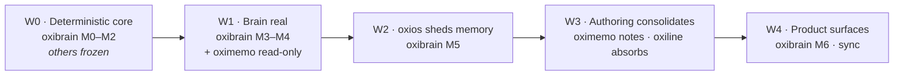

# The oxi Ecosystem — Architecture and Cross-Project Roadmap

> **Version:** v0.2 · **Date:** 2026-08-11 · aligned to `ARCHITECTURE.md` v2.0
> **Status:** Design. Sequencing is a commitment; per-app internals are not.
> **Authority:** Canonical for *how the oxi apps compose around oxibrain* and for the order in
> which that happens. Each app's own docs remain canonical for its internals.
> **Companion:** `doc/ARCHITECTURE.md` — oxibrain itself.

---

## 0. TL;DR

Four apps, one brain, one verb each.

| App | Verb | Owns |
|---|---|---|
| **oximemo** | *capture and write* | the vault — plain markdown files, the human's words |
| **oxiline** | *manage time* | routines, schedule, the day |
| **oxios** | *run agents* | agent runtime, sessions, tools |
| **oxibrain** | *remember and understand* | the ledger and the knowledge graph |

No app owns two verbs. No verb has two owners. Everything else in the ecosystem —
`oxicode` (agent SDK), `oxibrowser`, `oxibuilder` — either supplies a library to these
or contributes episodes to the brain.

The single organizing rule:

> **Each app keeps its own source of truth. oxibrain understands across them.**

That is what makes the brain shared infrastructure without making it a single point of
failure: if the brain is down, oximemo still captures, oxiline still runs the day, and
oxios agents still execute — with worse memory, not with no function.

---

## 1. Why this shape

### 1.1 The current problem

The ecosystem has overlapping ownership today, and it is not a matter of taste:

- `oxios-markdown` is largely a **port of the third-party `files.md` PKM server** — journal,
  habits, schedule, checklist, chat, sync, plugins. An entire note-taking product lives inside
  an agent OS.
- Its `habits` / `schedule` / `checklist` modules are, functionally, **oxiline**.
- Its `journal` / `knowledge` / `backlinks` are, functionally, **oximemo**.
- Every app that wants memory re-derives how to remember. There is no shared substrate — only
  `oxicode-sdk` and a visual design doc are shared today.

So the ecosystem has three note surfaces, two schedule surfaces, and zero shared memory. The
decomposition below is not a new invention; it is mostly a **relocation of code that already
exists to the app that already is that product**.

### 1.2 The shape

```
        ┌──────────────┐   ┌──────────────┐   ┌──────────────┐   ┌──────────────┐
        │   oximemo    │   │   oxiline    │   │    oxios     │   │  external    │
        │  capture ·   │   │  routines ·  │   │  agents ·    │   │  Claude,     │
        │  write       │   │  the day     │   │  tools       │   │  editors     │
        └──────┬───────┘   └──────┬───────┘   └──────┬───────┘   └──────┬───────┘
               │ vault (.md)      │ SQLite           │ sessions         │
               │  ── owns it ──   │  ── owns it ──   │  ── owns it ──   │
               └──────────────────┴─────┬────────────┴──────────────────┘
                                        │  MCP (2026-07-28) / unix socket
                                        ▼
                        ┌───────────────────────────────┐
                        │   oxibrain serve --daemon     │
                        │   ledger + knowledge graph    │
                        │   sole owner of ~/.oxi/brain  │
                        └───────────────────────────────┘
```

Every arrow into the brain is **episodes**. Every arrow out is **reconstruction** —
context, beliefs, timelines, neighborhoods. Nothing else crosses.

### 1.3 What the research says about this shape

The design was checked against the 2026 state of the art rather than assumed (sources in
`ARCHITECTURE.md` §25):

- **Temporal knowledge graphs beat flat vector memory on the questions that matter.** Zep
  reports 63.8% vs. mem0's 49.0% on LongMemEval/GPT-4o, attributed to storing validity
  windows rather than snapshots. This is the thesis; if oxibrain cannot reproduce a gap of
  that character, the architecture has not earned its complexity.
- **Files-as-truth plus MCP-as-interface is a validated product shape.** Basic Memory does
  exactly this and is well-adopted. Its limitation — no entity-level temporal model — is
  precisely oxibrain's contribution.
- **Explicit retention beats implicit decay.** A comparative study across thirteen agent-memory
  configurations found that where the control plane sits determines what silently disappears,
  and that vector-only retrieval systematically forgets dissimilar-but-relevant context.
  Hence P5 (forgetting ≠ deleting) and hybrid-by-default.
- **Local-first PKM has converged on CRDT sync** (Anytype, AFFiNE, Logseq's DB rewrite). The
  ecosystem's eventual sync answer is Loro (Rust, stable 1.x), not a file-sync hack — but
  after v1.
- **Embedded graph databases are not the answer here.** KùzuDB, the strongest candidate, is
  archived. SQLite with recursive CTEs + FTS5 + `sqlite-vec` + RRF is the mature choice for a
  single-user machine.

---

## 2. Contracts between the apps

These are binding. An integration that breaks one is wrong even if it works.

### C1 — The brain is additive, never load-bearing

Every app must retain its primary function with the daemon stopped. oximemo captures to files;
oxiline runs the day; oxios agents execute without memory. Integrations degrade to a disabled
panel, never to a blocked action or a spinner. **Test it: each app's CI runs its main flow with
no brain reachable.**

### C2 — One space, many sources

Spaces are privacy boundaries (personal / work / a client), **never app boundaries**. All four
apps write into the same space with different `SourceRef` labels. Partitioning by app rebuilds
the silos the brain exists to remove — the entire point is that a Tuesday routine, a note from
March, and yesterday's agent session can be seen to concern the same entity.

### C3 — Files are edited by their owner, ingested by the brain

oxibrain never writes into a user's vault. It reads through a connector. Annotations it wants
to surface (contradictions, suggested links, entity mentions) are returned through the API and
rendered by the owning app — they are not written into the user's files.

### C4 — An edit is a new episode, not an update

When a note changes, the connector writes a **new episode** (new content hash) rather than
mutating the old one. The ledger therefore records how a note evolved, which is what makes
"when did I change my mind about this?" answerable. Debounce and a minimum-diff threshold keep
this from becoming version spam; consolidation compacts old revisions (`ARCHITECTURE.md` §13).

### C5 — One installation root

```
~/.oxi/
├── config.toml        # shared: which brain, which space, provider settings
├── brain/             # oxibrain store — daemon is the sole writer
├── vault/             # oximemo's markdown — oximemo is the sole writer
└── line/              # oxiline's data — oxiline is the sole writer
```

One root, one config file, one daemon. Each subtree has exactly one writer. Apps discover the
brain by convention, not configuration, so a fresh install of any app finds the existing brain
with no setup.

### C6 — Integration is a client dependency, never a fork

Apps depend on `oxibrain-client` (thin, stable, semver'd). Nobody links `oxibrain-core`. Nobody
opens the store file directly. Target integration cost: **under 200 lines per app.** If an
integration is bigger than that, the missing capability belongs in the brain.

---

## 3. Per-app architecture

### 3.1 oximemo — capture and write

**Today:** card-based memo app for macOS. Plain `.md` + TOML frontmatter as the source of
truth, `redb` metadata index, `tantivy` BM25, GUI/CLI parity, double-`Option` overlay at
≤16 ms. It explicitly rejects AI features.

**Becomes:** the ecosystem's authoring interface — capture *and* documents.

The growth is smaller than it sounds, because a memo and a document differ by **one
frontmatter field**: a title. Cards without titles render on the grid; titled files render in a
document view. One vault, one index, two views, plus a promotion gesture ("give this a title").
No second data model.

Scope it takes on: title + document view, headings/outline, wiki links, backlink panel,
folder/tag organization.
Scope it must refuse: habits/schedule/checklist (→ oxiline), any AI feature (→ oxibrain),
plugin systems, a knowledge-graph view (→ oxibrain).

The line between oximemo's backlink panel and oxibrain's graph is worth stating because it will
come up repeatedly: **oximemo shows structure the user typed; oxibrain shows structure it
inferred.** Both exist, neither duplicates.

Two guardrails, to be written into oximemo's own conventions file:

1. **The capture path is inviolable.** Note mode may not add one millisecond to
   `Option`×2 → overlay → save. The ≤16 ms budget is CI-measured, not a past achievement.
2. **The "no AI" promise survives.** oximemo still contains no model, no prompt, no embedding.
   Intelligence arrives over a socket from the brain, and is always in a panel the user can
   close.

**Platform note:** oximemo is macOS/Apple Silicon. Making it the ecosystem's authoring surface
would make *authoring* macOS-only, which today's oxios web UI is not. Tauri v2 is
cross-platform; what is macOS-specific is the global hotkey and the pre-warmed overlay. So:
**note mode ships cross-platform; the capture overlay stays macOS-first.** Non-mac users lose
instant capture, not authoring.

**Brain integration:** vault connector (watch → episode). Panels: related notes, contradictions,
entities mentioned, "you wrote about this before". All read-only, all closable, all degrade to
absent when the daemon is down (C1).

### 3.2 oxiline — manage time

**Today:** routine/day-management, "time as a playhead", Rust core + Tauri v2, CLI-first, early
development.

**Becomes:** the single owner of everything time-shaped in the ecosystem. It absorbs
`habits` (438 LOC), `schedule` (381), `checklist` (485), and the world-clock plugin from
`oxios-markdown` — code that is already written, already tested, and currently in the wrong
repository.

Being early-stage is an advantage: it can accept these before it has an installed base to
migrate.

**Brain integration:** writes `Event` episodes (routine completions, schedule changes) —
a stream nothing else in the ecosystem produces, and the one that makes questions like
"since when have I done this every Tuesday?" and "what was I doing the week that project
stalled?" answerable. Reads timelines back.

This is the integration most likely to be underestimated. Time-series behavioral data plus a
temporal knowledge graph is a combination almost no personal tool has, because almost no
personal tool owns both.

### 3.3 oxios — run agents

**Today:** Agent OS — agent runtime, sessions, tools, MCP client, single binary with an
embedded web UI — **plus** a memory subsystem (`oxios-memory`, 12.7 KLOC) **plus** a ported PKM
product (`oxios-markdown`).

**Becomes:** an agent runtime. Nothing else.

It sheds in two independent movements:
- **Memory → oxibrain.** `oxios-memory` is triaged during M5 and deleted; agents call
  `assemble_context` per turn instead of implementing recall.
- **PKM → oximemo + oxiline.** `oxios-markdown` is dissolved along the lines in §1.1.

What remains is coherent and, notably, *smaller*: sessions, tool execution, agent
orchestration, the MCP client, and a web UI for driving agents rather than for taking notes.

**Brain integration:** the heaviest of the four. Writes `Conversation` and `AgentTrace`
episodes; reads `assemble_context` on every turn. Latency matters here in a way it does not
elsewhere — hence the §13.2 target of < 150 ms for a 3K-token context assembly.

**One caution:** shedding the web PKM UI removes the ecosystem's only browser-accessible,
cross-platform authoring surface. That loss must be accepted deliberately (see §3.1's platform
note), not discovered afterward.

### 3.4 oxibrain — remember and understand

Covered by `ARCHITECTURE.md`. Its ecosystem-facing obligations:

- Ship `oxibrain-client` before asking any app to integrate.
- Never require an app to change its storage.
- **Never require an API key, an account, or a second install to be useful.** oxibrain ships its
  own model (`ARCHITECTURE.md` §8, C2); MCP client sampling and HTTP providers are optional
  quality tiers, never the path to a working product.
- **Never make quality depend on the user's language** (`ARCHITECTURE.md` §7, C3). An ecosystem
  app must be able to ship internationally without asking what the brain supports.
- Stay independently valuable: someone who uses none of the other three must still get a
  complete second brain from `cargo install oxibrain`. If that ever stops being true, the brain
  has degenerated into oxios's memory library.

### 3.5 The rest

| Project | Relationship |
|---|---|
| `oxicode` | agent SDK. Supplies `oxicode-ai` as an optional `LlmPort` adapter. Does **not** depend on the brain. |
| `oxibrowser` | contributes web-clip episodes at the `Untrusted` trust tier — the tier exists partly for this. |
| `oxibuilder` | web platform, out of scope. May consume the brain over HTTP later. |
| marketing / sites | unaffected. |

---

## 4. Roadmap

Sequencing rules that produced this order:

1. **Nothing integrates with a brain that does not exist.** No app work before oxibrain M1.
2. **Deterministic before probabilistic.** The correctness-critical core lands with no LLM in it.
3. **Read-only integrations before write integrations.** A read-only failure cannot corrupt.
4. **Memory migration and authoring migration are independent.** Doing them together triples
   the blast radius; memory goes first because it is the actual value.
5. **One app in motion at a time.** This is a solo effort; parallel large refactors across
   repositories is how ecosystems stall.



### Wave 0 — Deterministic core · *everything else frozen*

**oxibrain M0–M2.** Store, migrations, ledger, writer actor, ports, content-derived identity.
Then the entire deterministic system: predicate registry, entities and identity, assertions,
the temporal fold, contradiction handling, resolution, reprojection — and then indexes, hybrid
query, traversal, community clustering, salience, `assemble_context`. **No LLM anywhere.**

**Every other app: no changes.** oxios keeps shipping exactly as it does today.

*Exit:* reprojection is byte-identical; fold property tests pass; a hand-built graph answers
multi-hop, thematic, and `as_of` queries; performance budgets measured.

*Why nothing else moves:* every integration decision made before this point would be
speculation about an API that does not exist yet.

### Wave 1 — The brain becomes real · *first consumer*

**oxibrain M3–M4.** Extraction pipeline with the eval harness and CI gates; then spaces,
scopes, tokens, audit, redaction, the MCP server on `rmcp`, the daemon, the markdown vault
connector, and `oxibrain-client`.

**oximemo integration #1 — read-only.** The vault connector (shipped in M4) ingests the
existing vault; oximemo gains a "related notes" panel. **No change to oximemo's data model,
storage, or capture path.**

*Why oximemo first, not oxios:* its vault is the richest human-authored corpus in the
ecosystem, so extraction quality becomes visible immediately; and a read-only integration has
no failure mode that can damage anything. It proves the topology at the lowest possible stakes.

*Exit:* an external MCP client uses the brain over a scoped token; two processes share one
brain through the daemon; benchmark numbers published for reference and default configurations;
oximemo's related-notes panel is useful enough that its author keeps it on.

### Wave 2 — oxios sheds memory

**oxibrain M5.** `oxios-kernel` routes memory through `Brain`. A one-time importer migrates
existing `oxios-memory` stores into episodes, after which extraction runs across the user's
entire memory history — the first moment the whole project visibly pays off. `oxios-memory` is
deprecated and deleted from the oxios workspace in the same PR that removes its last caller.

This wave also settles the one place contract **C1** is weakest: with no memory code of its
own, oxios agents facing a brain outage have *no* memory rather than degraded memory. Whether
that needs a small local recall cache is decided here, with real outage behavior in hand.

**oxios keeps its markdown UI throughout this wave.** That is a separate migration and mixing
them is how a "small" refactor becomes a quarter.

*Exit:* oxios ships with zero memory code of its own; the last `oxios_memory::` import is gone.

### Wave 3 — Authoring consolidates

The largest wave, and the one most likely to slip. Ordered by dependency:

1. **oxiline absorbs time features** — `habits`, `schedule`, `checklist`, world-clock move from
   `oxios-markdown`. Smallest, most mechanical, and unblocks the rest.
2. **oximemo grows note mode** — title/document view, outline, wiki links, backlink panel;
   cross-platform build; capture path unchanged and CI-measured.
3. **oximemo integration #2 — bidirectional** — quick capture writes episodes directly; the
   brain's contradiction and link suggestions surface inline.
4. **oxios deletes `oxios-markdown`** — only after (1) and (2) actually ship. Its web UI drops
   the PKM sections and keeps agent-driving.
5. **oxiline integration** — `Event` episodes, timeline reads.

*Exit:* each verb has exactly one owner; `oxios-markdown` no longer exists.

### Wave 4 — Product surfaces

**oxibrain M6** — the brain UI: graph explorer, timeline, ask-with-provenance, merge review,
contradiction inbox, quick capture. Explicitly not an editor.
**Ecosystem** — unified onboarding (one install, one `~/.oxi`), shared daemon lifecycle
(launchd/systemd), and multi-device **sync** via ledger log-shipping + Loro for the mutable
slices. Sync is an ecosystem concern by then, not an oxibrain feature, because all four apps
have state worth syncing.

---

## 5. What could go wrong

| Risk | Where it bites | Response |
|---|---|---|
| Wave 3 is genuinely large and stalls | authoring stays split across two apps | Waves 0–2 are independently complete. A stall means a slightly messy ecosystem with a working brain — recoverable, not fatal. |
| oximemo's identity erodes as it grows | the app that was fast becomes the app that was fast | Capture-path latency budget in CI; "no AI in oximemo" as a written rule. Both enforced, not intended. |
| Authoring becomes macOS-only | non-mac users lose the ecosystem's writing surface | Note mode ships cross-platform from the start; only the overlay is mac-specific. Decide before Wave 3, not during. |
| Extraction quality disappoints | the graph is noise and nobody trusts it | Eval gates block Wave 1 exit. M1 is useful with manual writes alone, so there is a floor. |
| The brain becomes a single point of failure | one crash takes down four apps | C1, with a CI test per app. |
| Four repos drift out of sync on shared conventions | integration rot | This document is canonical for the contracts; `~/.oxi` layout and `oxibrain-client` are the only shared surfaces, deliberately. |
| Solo bandwidth | everything | One app in motion at a time; every wave has a standalone exit criterion, so stopping between waves always leaves a coherent system. |

---

## 6. Open decisions

Each is scheduled, and none blocks Wave 0.

1. **Does oximemo become the authoring app, or does a new app?** — *default: oximemo grows.*
   Decide before Wave 3. Owner: oximemo's ADR.
2. **Is losing the browser-accessible authoring UI acceptable?** — *default: yes, accepted, with
   note mode cross-platform.* Decide with (1).
3. **Does `oxios-markdown`'s `sync` engine survive anywhere?** — it predates the Loro decision
   and may be redundant. *Default: retire it; revisit at Wave 4.*
4. **Does `oxicode`/`oxios` keep SONA (trajectory learning), or does procedural memory belong in
   the brain?** — *default: stays in oxios for v1.* Revisit once the brain has a real
   procedural-memory story.
5. **Team/shared-node deployment** — the design supports it (spaces, scopes, audit); whether it
   is a product is a separate question. *Default: capability exists, not marketed, until after
   Wave 4.*
